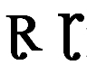

import CaptionText from '/src/components/CaptionText.astro';

:usv[2C64]{usv char name} is (or was) used orthographically in both the Heiban and Moro languages. Early use had the glyph on the right. However, more recent use is with the glyph on the left. The glyph on the left is also the glyph used in the [Unicode Code Charts](http://www.unicode.org/charts/PDF/U2C60.pdf).

<CaptionText text='This article formerly appeared on ScriptSource.'/>