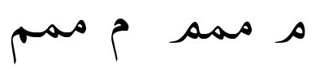

import Character from '/src/components/Character.astro';

In standard Arabic, and for most languages using the Arabic script, <Character usv="0645" options="usv,char,name"/> (and all related shapes) is what is seen on the left below. However, some languages have the isolate and final glyphs shorter as is seen on the right below. Sindhi is a well known language where the glyph variants on the right are expected. The variants on the right are also used in some languages in Africa.

