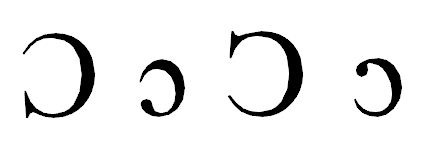

import Character from '/src/components/Character.astro';

The "open o" is used in the International Phonetic Alphabet (IPA) as well as by many languages. The glyph the Unicode Consortium (and IPA) use is on the left and the glyph used by many African orthographies is on the right:

<Character usv="2183" options="usv,char,name"/> was added to the Roman numeral block. <Character usv="2184" options="usv,char,name"/> was added for use as a Claudian letter. We do not recommend their use for anything other than what they were designed for. Please use <Character usv="0186" options="usv"/> and <Character usv="0254" options="usv"/> if you need an open o. Then find a font which has the serif where you want it. 
