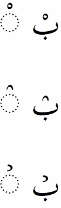

import CaptionText from '/src/components/CaptionText.astro';

The standard glyph for :usv[0652]{usv char name} is shown on the top row. However, it can have a variety of shapes, two of which are shown in the last two rows.

In Urdu, this character is called _jazm_.

<CaptionText text='This article formerly appeared on ScriptSource.'/>