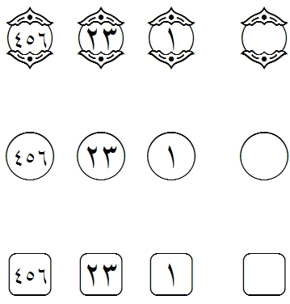

import CaptionText from '/src/components/CaptionText.astro';

:usv[06DD]{usv char name} can have many different appearances from very ornate to quite simple. End of Ayah is used as a "verse" marker (usually at the end of the verse) and must "hold" digits. In running text the :usv[06DD]{name} is typed followed by up to three digits. If the font has the correct "smarts" and if the application is designed to handle it, the digits will automatically be rendered within the End of Ayah.

<CaptionText text='This article formerly appeared on ScriptSource.'/>