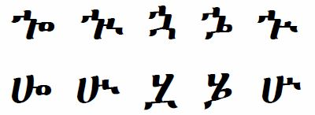

import CaptionText from '/src/components/CaptionText.astro';

The glyphs on the top row are the standard glyphs for this set of characters, and they are used in the Unicode code charts. The glyphs on the bottom row are sometimes used in handwriting since they are easier to reproduce than a character such as :usv[128B]{char}.

<CaptionText text='This article formerly appeared on ScriptSource.'/>