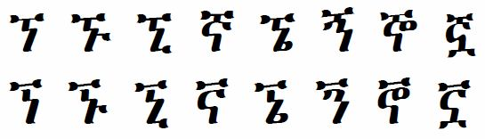

import CaptionText from '/src/components/CaptionText.astro';

The glyphs on the top row are the standard glyphs for this set of characters. They are the glyphs the Unicode Consortium uses in the Unicode code charts. The glyphs on the bottom row are required for use in the Gumuz language orthography. The only difference in glyphs is that the top "flag" is not connected to the bottom part of the character.

<CaptionText text='This article formerly appeared on ScriptSource.'/>