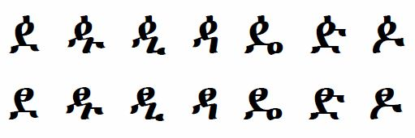

import CaptionText from '/src/components/CaptionText.astro';

The glyphs on the top row are the standard glyphs for this set of characters, and they are used in the Unicode code charts. The glyphs on the bottom row are an archaic form previously used for the Oromo orthography. The line through the bowl proved hard to reproduce in low quality printing.

<CaptionText text='This article formerly appeared on ScriptSource.'/>