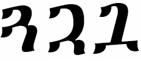

import CaptionText from '/src/components/CaptionText.astro';
import BibEntry from '/src/components/BibEntry.astro';

The glyph on the left is the glyph the Unicode Consortium uses in the Unicode code charts. The glyph in the middle is the glyph required for use in the Sebat Bet language. The glyph on the right is used in Alone-Stokes.

### Bibliography

- <BibEntry key="alone1946" />

<CaptionText text='This article formerly appeared on ScriptSource.'/>