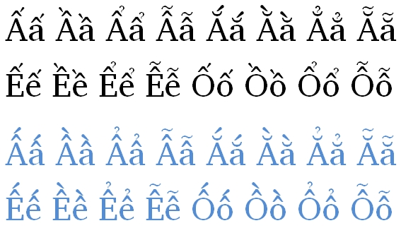

import CaptionText from '/src/components/CaptionText.astro';

There is a set of characters (:usv[1EA0]{usv}..:usv[1EFF]{usv}) that are traditionally thought of as "Vietnamese". Fonts are usually designed to include the Vietnamese style diacritics (where the highest diacritic is offset to create a tighter character). However, if another language uses the same diacritics, such as an acute and a circumflex, they can have the same character set, and in general they will _not_ want to end up with the Vietnamese style of glyphs. For African languages especially, the blue style of glyphs are what would be desired rather than the black style (Vietnamese).

<CaptionText text='This article formerly appeared on ScriptSource.'/>