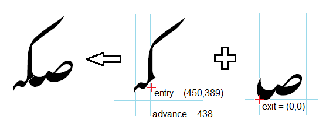
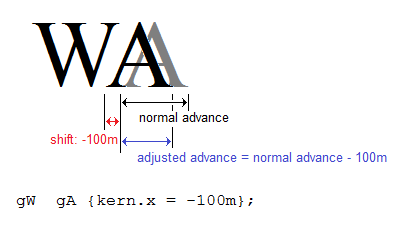
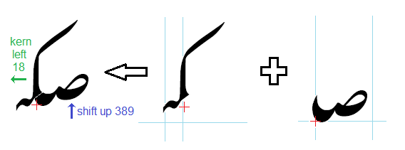

Recently I have been working on converting a nastaliq-style Arabic font from an OpenType implementation to Graphite. One of the first tasks involved adjusting the positions of the basic characters to form the sloping cursive connections characteristic of nastaliq.

The OpenType version of the smart-font code uses a "cursive attachment" type of lookup to position the base characters. This kind of lookup uses special anchor points called "exit" and "entry" to indicate how the two adjacent glyphs should be attached. For a left-to-right script, the "exit" point of the left-hand glyph is positioned to match the "entry" point on the right-hand glyph. In a right-to-left script, the behavior is as shown below, where the "exit" point of the right-hand glyph is positioned to match the "entry" point of the left-hand glyph.



Now Graphite does not provide any special kind of attachment to handle cursive connections. It might have been possible to use Graphite's standard attachment mechanism, but that is really intended to handle diacritic placement, and I was concerned that there might be awkward side effects of using it to align base characters. So instead my plan was to use the values of the "exit" and "entry" anchor points exported from OpenType to perform shifting and kerning.

As a reminder, Graphite defines three ways of adjusting the position of a glyph other than attachment:

- **shift** moves the glyph either vertically or horizontally without affecting any neighboring glyphs.
- **advance** changes the advance width of the glyph, which causes the following glyphs to be moved. (Currently Graphite only supports a horizontal advance, not vertical.)
- **kern** is actually a combination of advance and shift. Kerning by a given amount shifts the glyph by that amount and also changes the advance width, so that following glyphs don't collide. For instance, to kern the sequence "WA" to remove extra space between the diagonal strokes, you might use the following rule:

```
gW  gA {kern.x = -100m};
```

This is actually equivalent to:

```
gW  gA {shift.x = -100m; advance.x -= 100m};
```

The following graphic shows what the effect of this rule would be:



So my strategy was to shift the right-hand glyph vertically, but kern the left-hand glyph horizontally, as shown below:



I expected that a set of rules like the following would do the job:

```
initial=I {shift.y = @M.entry.y - exit.y + @M.shift.y}  medial=M {kern.x = entry.x - advancewidth - @I.exit.x};
```

This rule indicates how to attach an initial form to a medial. The initial glyph is raised by the difference between the entry and exit points' y-coordinates, plus the amount the medial has already been shifted (to account for further glyphs at the end of the word--note that we're working backwards!). This vertical adjustment is actually quite straightforward.

The horizontal adjustment turned out to be trickier. For the medial, `entry.x - advancewidth` indicates the amount by which that medial needs to be kerned to hook up with the initial. Most often `@I.exit.x` = 0, but occasionally a further adjustment is needed due to the fact that the exit point of the initial is not at its origin.

This worked beautifully for the vertical dimension, and almost worked perfectly for the horizontal direction. But every once in a while there was a situation where the two glyphs did not line up horizontally.

After much frustration and experimentation I discovered the fatal flaw in my logic. My approach would have worked perfectly in a left-to-right script, but it turns out that advance and kern operate slightly differently than expected in a right-to-left script.

The reason for this lack of parallelism stems from the fact that origin and advance width of a glyph are always defined in left-to-right coordinates, regardless of the directionality of the script. In other words, the advance width of a glyph in a font is defined to be the distance from the (left-hand) origin of the current glyph to the (left-hand) origin of the glyph to the right. In a left-to-right script, this is the distance from the right side of the previous glyph (the original origin of the current glyph) to the origin of the next. But for a right-to-left script, this is the distance from the left side of the previous glyph to origin of the current glyph.

This means that simply by changing the advance width, the glyph is shifted, as shown in the following graphic. (Notice that text is flowing from right to left, even though the example uses Latin letters.)


Therefore a kerning rule is not needed, and in some situations can be redundant. This was causing errors in my nastaliq rendering.

So by using the following rule which performs only advance adjustment instead of kerning, the positioning came out right every time:

```
initial=I {shift.y = @M.entry.y - exit.y + @M.shift.y}  medial=M {advance.x += entry.x - advancewidth - @I.exit.x};
```