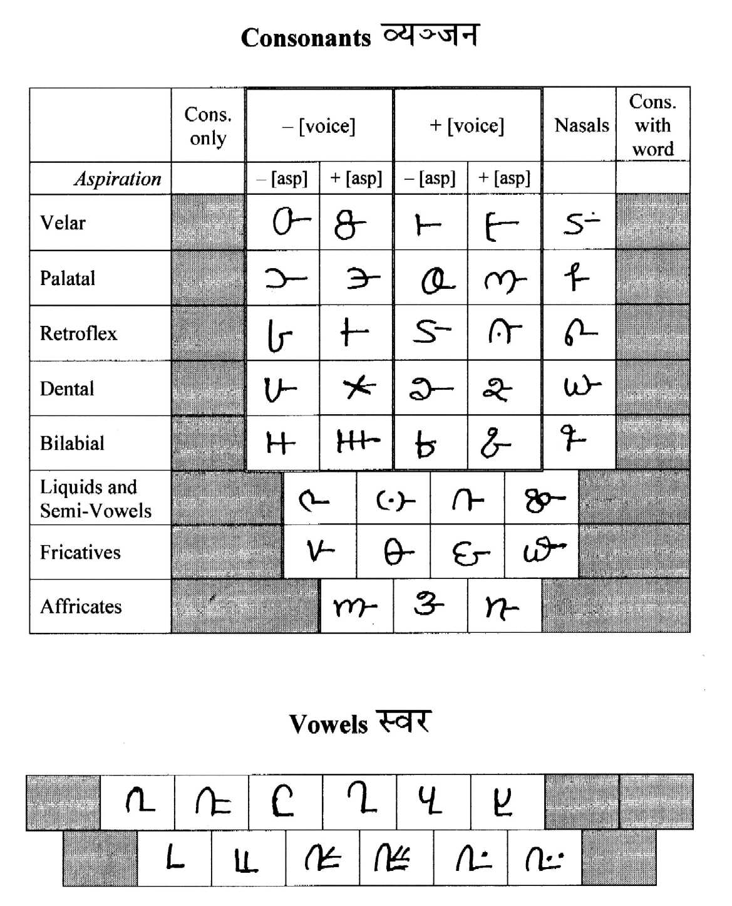

import CaptionText from '/src/components/CaptionText.astro';
import Attribution from '/src/components/Attribution.astro';

This chart of the Gondi script was filled in by Ramesh Gedam, of Mondigutta, Gadchiroli Dist, MH, India. He filled it in from memory, but later confirmed the information. (November 2001)

<Attribution type='Image' copyyears='2001' copyholder='Ramesh Gedam' author='' license='CC BY-SA 3.0' licenseUrl='https://creativecommons.org/licenses/by-sa/3.0/' source='' sourceurl=''/>

<CaptionText text='This article formerly appeared on ScriptSource.'/>