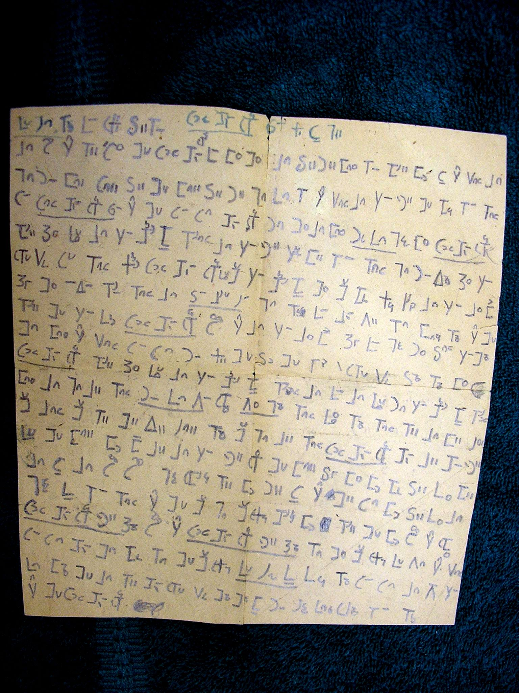

import CaptionText from '/src/components/CaptionText.astro';
import Attribution from '/src/components/Attribution.astro';

This is a handwritten note which was found in a book of hymns, _Hwa Miao Gospel Hymns_, published in 1938 in Changsha, Hunan Province. The book was given to SIL by John F. Graham, who was born in a Miao village in 1931.

<Attribution type='Image' copyyears='' copyholder='' author='' license='Public Domain' licenseUrl='' source='' sourceurl=''/>

<CaptionText text='This article formerly appeared on ScriptSource.'/>