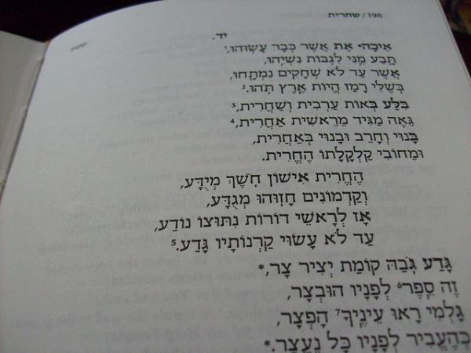

The Kinot are a liturgical set of poems or dirges expressing mourning, pain, and suffering. This text is to be read on the occasion of Tisha B'Av, a day of fasting in the Jewish calendar to commemorate the destruction of the temples in Jerusalem.

*Source:* ["Kinot"][kinot] by [Chajm Guski][chajm-guski], [CC BY-SA 2.0][copyright-some-rights-reserved]

[chajm-guski]: https://www.flickr.com/photos/chajms/
[copyright-some-rights-reserved]: https://creativecommons.org/licenses/by-sa/2.0/deed.en
[kinot]: https://www.flickr.com/photos/chajms/3755358837