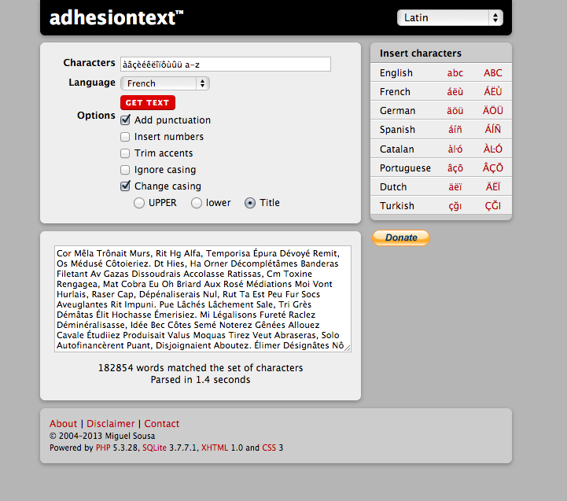
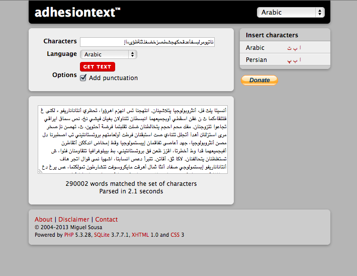
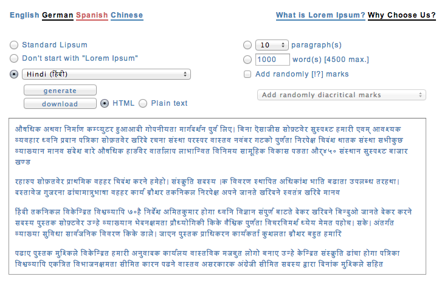
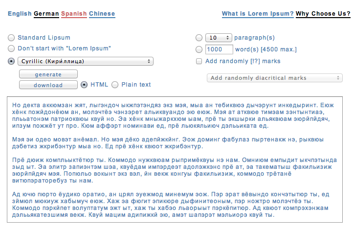

import CaptionText from '/src/components/CaptionText.astro';

As a designer of non-Roman scripts I often have a need for text with which to do testing. But if I don't speak a language that uses that non-Roman, trolling the web for decent samples can be frustrating and time consuming. I recently discovered that for some initial tests, there are a couple of good free resources: adhesiontext™ and a lorem-ipsum generator. 

[Adhesiontext™][adhesiontext] generates words using a whole or partial character set, like the Latin or Arabic alphabets. Depending on the script, you get a few options like punctation and case. It produces a dummy paragraph with words that have or are close to having actual meaning. The nicest feature of adhesiontext™ is its capability of generating text with only a few letters. This is extremely useful for testing a font-in-progress in the FontLab metrics window or in Indesign. Adhesiontext™ only returns one paragraph though, so if you're looking for a more natural flow of text, or content for several pages, then the [lorem-ipsum][lorem-ipsum] generator is better.

[Click here for the multilingual lorem-ipsum generator][lorem-ipsum]

This particular generator doesn't offer as many different scripts as adhesiontext™ does, but it does give you options for Chinese, Japanese, and even Morse code, if you are so inclined. The generated text has a much more natural feel, with long and short words broken down into as many paragraphs as specified. It works pretty much like any normal content generator. 

<CaptionText text='This article, written by Becca Hirsbrunner Spalinger, formerly appeared on ScriptSource.'/>

[adhesiontext]: https://adhesiontext.com/
[lorem-ipsum]: https://generator.lorem-ipsum.info/
