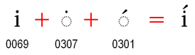
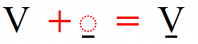
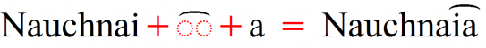
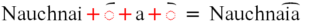
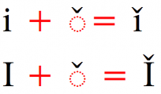
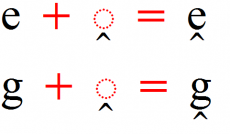
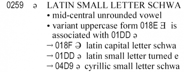
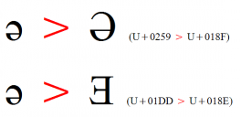
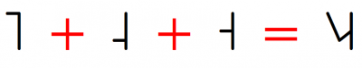

## Glottals

**Question:** What character should I use to represent the glottal stop?

**Answer:** There are a lot of different things that people have done in the past.

If you want something that looks like a curly quote you should use :usv[02BC]{usv char name}. You could use :usv[2019]{usv char name}, but there are at least two issues with that. It is considered punctuation with different properties than an orthographic character and if you use quote marks there is nothing to distinguish between the two characters. (Our Roman fonts (such as [Andika][font-andika], [Charis][font-charis], and [Gentium][font-gentium]) all have an alternate glyph for :usv[02BC]{usv char name} which is a bit larger than normal to help distinguish the glyph from :usv[2019]{usv char name}.)

Many orthographies have used something that looks like the straight quote. There were so many problems with using :usv[0027]{usv char name} for this character that we requested the addition of a character to Unicode for that. You should use :usv[A78C]{usv char name} (one language even "cases" this and :usv[A78B]{usv char name} is used for the uppercase). (Our Roman fonts (such as [Andika][font-andika], [Charis][font-charis], and [Gentium][font-gentium]) all have an alternate glyph for :usv[A78C]{usv char name} and :usv[A78B]{usv char name} which are a bit larger than normal to help distinguish the glyph from U+0027  APOSTROPHE.)

:usv[02BE]{usv char name} is sometimes used for transliterating Arabic hamza (glottal stop). This looks different from both :usv[A78C]{usv char name} and :usv[02BC]{usv char name} and might be a good option for traditions which recognize the transliterated hamza.

Some Saskatchewan orthographies use an upper and lowercase glottal stop. Those are :usv[0241]{usv char name} and :usv[0242]{usv char name}.

Of course, the IPA representation is :usv[0294]{usv char name} and some languages also use this in their orthographies (where casing is not required).

## Diacritics

**Question:** I want to put a diacritic on a “dotted i” and want to retain the dot on the “i”. Can you add that feature to your fonts?

**Answer:** The Unicode Standard addresses this in [chapter 7][uni-ch7]. You should encode it as :usv[0069]{usv char name} + :usv[0307]{usv char name} + :usv[0301]{usv char name}.

---

**Question:** I need a “V”, “t”, “n” and “l” with a macron under each. Unicode does not have these characters. Can you add these to your [PUA][sil-pua] and get them into Unicode for me, or is there another way I can encode this character?

**Answer:** Unicode does have some precomposed characters because they already existed in standards. The Unicode Technical Committee will no longer accept precomposed forms unless there is a very convincing argument.

However, each of these can be encoded in Unicode. So, for example “V” with a macron under it should be encoded as two characters (:usv[0056]{usv char name} + :usv[0331]{usv char name}):

The same thing can be done with each of your other characters, and, in fact, any other base + diacritic.

--- 

**Question:** You have left out one crucial Unicode range of four diacritics which are used within the Latin-script in the library world: U+FE20..U+FE23.

- :usv[FE20]{usv char name}
- :usv[FE21]{usv char name}
- :usv[FE22]{usv char name}
- :usv[FE23]{usv char name}

Transliterated Cyrillic records e.g. make heavy use of the first two.

**Answer:** Originally we made a deliberate decision not to include the combining half marks in our fonts. We consider :usv[0360]{usv char name} and :usv[0361]{usv char name} to be the preferred characters to use. Thus, to put the :usv[0361]{usv char name} over an “ia”, the preferred encoding would be to put the :usv[0361]{usv char name} between “ia” (i + :usv[0361]{usv char name} + a):

However, we were convinced that the library world does need this range and so they were added to our Unicode Roman fonts ([Andika][font-andika], [Charis][font-charis], and [Gentium][font-gentium]). Positioning of these may not be perfect.

---

**Question:** I need a diacritic on an “i”. Should I use the dotless “i” that I found in Unicode or what should I do? I also need to have a diacritic that will go on the upper case “i” and I can't find different heights for the diacritics.

**Answer:** This is where Unicode is really, really useful. You no longer need to encode two different versions of an “i” and two different versions of a diacritic. In fact, you should not! If you look at the character properties for the character you have suggested (:usv[0131]{usv char name}) you will see that this character is only used for Turkish and Azerbaijani.

So, you should just use the base character plus the diacritic. (This makes data analysis much simpler as well.) Unicode, along with smart fonts, will automatically handle the dot removal for the “i” and height adjustment for the upper case “i”. For example, i with caron would be encoded as i + :usv[030C]{usv char name}.

In the following example you can see that the diacritic is shifted down if you have characters that have descenders:

## Overlays

**Question:** I need to use a slash “L” (:usv[0141]{usv char name}). I can see that Unicode has a precomposed slash “L”. Would it be better for me to use the precomposed version or make it decomposed?

**Answer:** Sometimes people get confused about whether to use precomposed or decomposed characters that are in Unicode. A simple rule-of-thumb to go by is that if a character has diacritics (either above or below the character), it can be decomposed. If the character has an “overlay” (superimposed on the character) then the preformed (not precomposed) character should be used.

An easy way to find Unicode characters is to look at the [Collation charts][uni-collation]. This page is sorted alphabetically. However, it does not show character properties and decompositions, so if you find you need that information you will need to go to the Unicode website to find that information. You can find [charts][uni-charts] of all the Unicode characters at this site.

In the example we are using (:usv[0141]{usv char name}) you will find that there is no decomposition listed for this character and so you should not use “L” + “/” (:usv[004C]{usv char name} + :usv[0338]{usv char name}). This also means that we should not be using the term “precomposed” for this character, rather, it is “preformed”.

---

**Question:** I cannot find a barred :usv[0261]{usv char name}. Can you add it to your PUA?

**Answer:** Although what you are requesting looks different, fundamentally this is the same character as :usv[01E5]{char}. You should encode it as :usv[01E5]{usv char name}. The [Charis][font-charis] font allows you to choose the barred bowl form through **Font Features** (if you have an application which allows for this).

## Character choices
---

**Question:** How do I know which version of the schwa to use? There is :usv[0259]{usv char name} and :usv[01DD]{usv char name}.

**Answer:** This one will rise up and bite you if you are not careful! This is where looking at the documentation is important. If you look at :usv[0259]{usv char name} you will see:

There are a number of useful bits of information here. Firstly, you see that it tells you :usv[018E]{usv char name} is associated with :usv[01DD]{usv char name}. The second bit of useful information is in the first cross reference you are given: :usv[018F]{usv char name}. This tells us that :usv[018F]{usv} is the upper case match to this character.

Another interesting test is to type both of the schwas into a word processor (like Word). Select them both and click on **Format / Change Case... / UPPER CASE**. You should see two different forms of the upper case schwa. This shows you how important it is to match the lower case character (which looks exactly the same) with the correct upper case character (which looks significantly different).

In this example you want to make sure that if you are using :usv[018F]{usv char name} in your orthography, you should make sure the lower case is :usv[0259]{usv char name}.

--- 

**Question:** I've noticed that when I'm looking for phonetic characters, not everything I want is in the IPA extensions.

For example, the beta which is used for a voiced bilabial fricative is, I believe, supposed to be encoded as :usv[03B2]{usv char name}, but that is in the Greek section, and its documentation does not make explicit that it is supposed to be used for a bilabial fricative nor that it is part of the IPA. So, I am still not absolutely sure I've got the right character.

**Answer:** You are right about the voiced bilabial fricative being encoded as :usv[03B2]{usv char name}. The bigger question, of course, is a need to know all the characters sanctioned as part of the IPA and what their Unicode codepoints are.

The  official IPA site does not currently do this for us. There are several places you can check for this information. [IPA Unicode codepoints](/articlelib/i/ipa-transcription-with-sil-fonts/#ipa-unicode-codepoints) gives several resources.

--- 

**Question:** I want an open o with the serif at the top. I see that Unicode now has :usv[2183]{usv char name} and :usv[2184]{usv char name}. Can I use those instead of :usv[0186]{usv char name} and :usv[0254]{usv char name}?

**Answer:** :usv[2183]{usv char name} was added to the Roman numeral block  for use as a Claudian letter. We do not recommend their use for anything other than what they were designed for. Please use :usv[0186]{usv char name} and :usv[0254]{usv char name} if you need an open o and find a font which has the serif where you want it. Our SIL Roman Unicode fonts provide an alternate form, so if you have an application that can handle it, you can choose whether you want a top or bottom serif.

--- 
**Question:** I want a handwritten style a. Unicode has U+0251  LATIN SMALL LETTER ALPHA. Can I use that?

**Answer:** :usv[0251]{usv char name} is in Unicode as an IPA symbol. Please do not use it instead of an "a". You should find a font which has a handwritten style "a" at :usv[0061]{usv char name}. If you use :usv[0251]{usv char name} you will have unexpected results with data analysis as well as when using uppercase/lowercase pairs.

The only time you would want to use :usv[0251]{usv char name} in an orthography is if you have contrastive use between :usv[0251]{usv char name} and :usv[0061]{usv char name}. Then, you would also want to use :usv[2C6D]{usv char name} for the uppercase of :usv[0251]{usv char name}.

## Tone

**Question:** I see that Unicode (and your [Charis][font-charis] font) has individual tone letters (U+02E5..U+02E9), but does not have the tone glides. Can you get those encoded in Unicode? They are very important in linguistic work.

**Answer:** Unicode can already handle these. You do need a smart font (like [Charis][font-charis]) to make it work. You should type the tone letters in the correct linguistic order and they should become the correct tone glide. For example:

<CaptionText text='This article formerly appeared on scripts.sil.org.'/>

[font-charis]: https://software.sil.org/charis/
[font-andika]: https://software.sil.org/andika/
[font-gentium]: https://software.sil.org/gentium/
[sil-pua]: https://github.com/silnrsi/unicode-resources/tree/main/sil-pua
[uni-ch7]: https://www.unicode.org/versions/latest/core-spec/chapter-7/#G15982
[uni-collation]: https://www.unicode.org/charts/collation/
[uni-charts]: https://www.unicode.org/charts/
