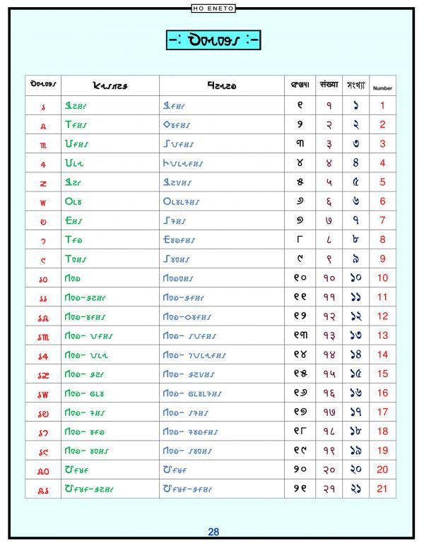

import CaptionText from '/src/components/CaptionText.astro';
import Attribution from '/src/components/Attribution.astro';

This image shows the numerals from 1 to 21 used by the Ho language written with the Warang Citi script.

<Attribution type='Article' copyyears='2018' copyholder='Mangalsing Sinku' author='' license='CC BY-SA 3.0' licenseUrl='https://creativecommons.org/licenses/by-sa/3.0/'/>

<CaptionText text='This article formerly appeared on ScriptSource.'/>