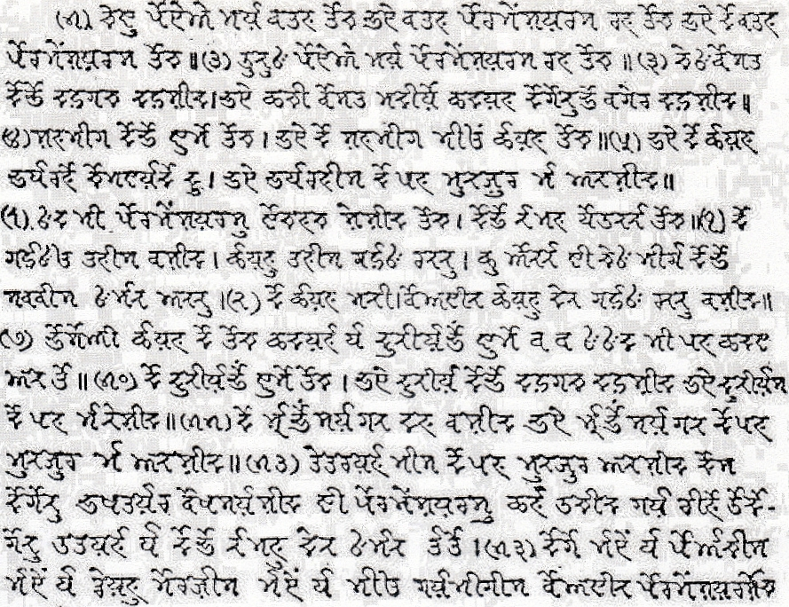

import CaptionText from '/src/components/CaptionText.astro';
import Attribution from '/src/components/Attribution.astro';

This is an excerpt from the introductory page of a translation of John's Gospel in the Kinnauri language, using the Takri script. This gospel was published by the British and Foreign Bible Society (BFBS) in 1917.

<Attribution type='Image' copyyears='' copyholder='' author='' license='Public Domain' licenseUrl='' source='' sourceurl=''/>

<CaptionText text='This article formerly appeared on ScriptSource.'/>