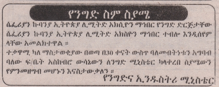

import CaptionText from '/src/components/CaptionText.astro';

Inverted text is very common and is often seen as white text on black background especially in the classified sections of newspapers. It is, to a large extent, used as a substitute for bold text.

<CaptionText text='This article formerly appeared on ScriptSource.'/>