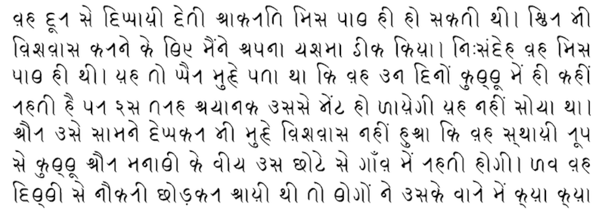

import CaptionText from '/src/components/CaptionText.astro';
import Attribution from '/src/components/Attribution.astro';

This is a sample text provided by Anshuman Pandey, written in the Kaithi font he is in the process of developing. At the time of writing, the font is not yet ready for public release.

<Attribution type='Image' copyyears='2011' copyholder='Anshuman Pandey' author='' license='CC BY-SA 3.0' licenseUrl='https://creativecommons.org/licenses/by-sa/3.0/' source='' sourceurl=''/>

<CaptionText text='This article formerly appeared on ScriptSource.'/>