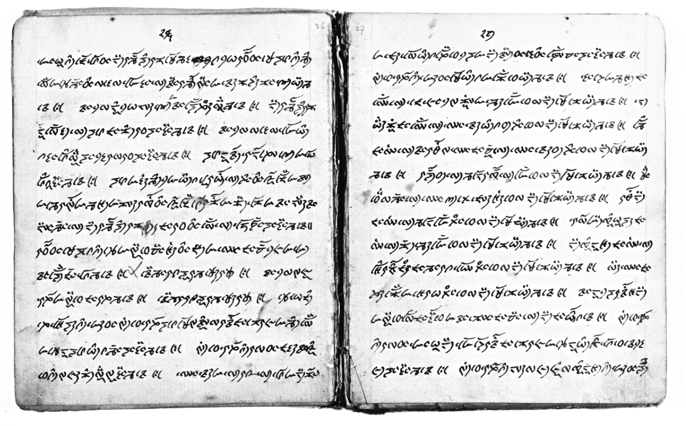

import CaptionText from '/src/components/CaptionText.astro';
import Attribution from '/src/components/Attribution.astro';

Early 20th century manuscript L17 from the "van Manen collection" at the Kern Institute, Leiden University. The text, in the Lepcha language and script, is entitled 'ekádoshi sá munlóm', that is, the worship of Ekádoshi.

<Attribution type='Image' copyyears='2003' copyholder='Heleen Plaisier' author='' license='CC BY-SA 3.0' licenseurl='https://creativecommons.org/licenses/by-sa/3.0/' source='' sourceurl=''/>

<CaptionText text='This article formerly appeared on ScriptSource.'/>