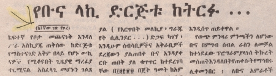

import CaptionText from '/src/components/CaptionText.astro';

Emphasizing words with a line above and a line below is very common, especially in newspapers. This may be a substitute for either bold or italic type .

<CaptionText text='This article formerly appeared on ScriptSource.'/>