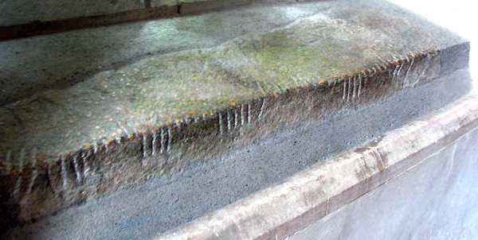

import CaptionText from '/src/components/CaptionText.astro';
import Attribution from '/src/components/Attribution.astro';

The Maglocunus Stone has been dated to the 5th or 6th century. It is inscribed in Latin "MAGLOCUNI FILI CLUTORI" and in Ogham "maglicunas maqi clutari", translated as _(the stone) of Maglicu, son of Clutarias_. The stone would have originally been oriented vertically, with the lines inscribed horizintally, but it has been rotated 90° so it could set into the windowsill of Nevern church in Pembrokeshire, Great Britain, where it is now located.

<Attribution type='Image' copyyears='2011' copyholder='Chris Gunns' author='' license='CC BY-SA 2.0' licenseUrl='https://creativecommons.org/licenses/by-sa/2.0/' source='Geograph' sourceurl='http://www.geograph.org.uk/photo/544214'/>

<CaptionText text='This article formerly appeared on ScriptSource.'/>