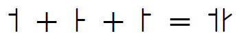
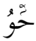
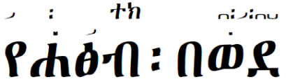
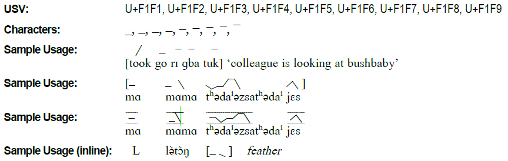
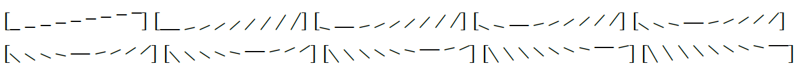
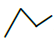
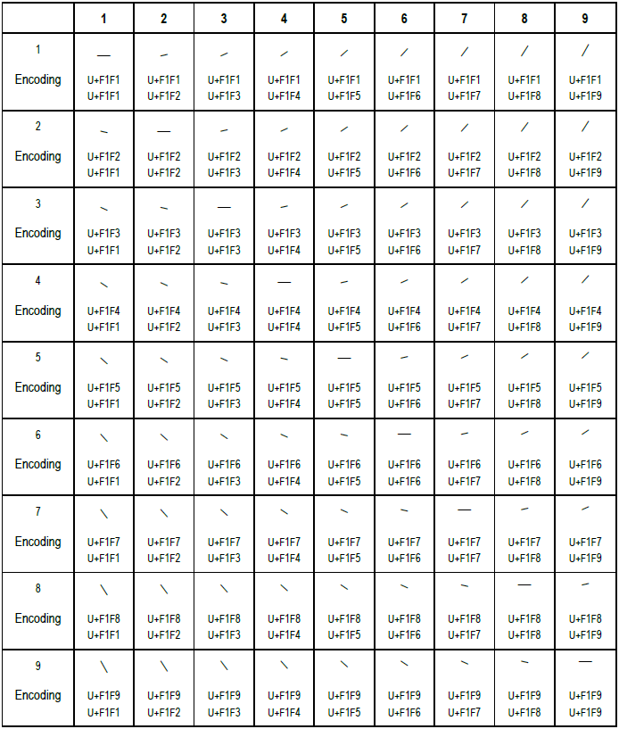

---
title: Marking Tone
tags: [script-latn, script-plrd, script-lisu, script-thai, script-laoo, script-deva, script-nkoo, script-mymr, script-ethi, script-tale, script-talu, script-lana, script-kali, script-tavt, script-mtei, script-rohg, script-pauc, script-bass, script-toto, script-hmnp, script-wcho]
lastUpdated: 2026-05-13
---

import CaptionText from '/src/components/CaptionText.astro';
import Attribution from '/src/components/Attribution.astro';

## Abstract

This paper was originally intended to explain why pitch contours, which are used in linguistic analysis and documentation of tone languages, have been encoded in the [SIL Corporate PUA][sil-pua] and in our SIL Unicode Roman fonts. Section 1 covers the existing tone marking systems in Unicode. Section 2 provides the rationale for adding Pitch Contour characters to the PUA, and a detailed discussion of how such characters have been encoded and implemented  (they have subsequently been removed).

## Existing Systems in Unicode

Unicode already supports many different systems for marking tone. These are discussed in the following subsections.

### Superscript/Subscript numbers

Superscript numbers indicate a numbered toneme (e.g. 1 = first tone). In Chinese linguistics ¹ represents low tone and ⁵ represents high tone and Americanists represent ¹ as high tone and ⁵ as low tone. In African linguistics both orders are found.
Appended numbers give tonal contours directly (e.g. 35 = high rising)

- :usv[00B9]{usv char name}
- :usv[00B2]{usv char name}
- :usv[00B3]{usv char name}
- :usv[2074]{usv char name}
- :usv[2075]{usv char name}
- :usv[2081]{usv char name}
- :usv[2082]{usv char name}
- :usv[2083]{usv char name}
- :usv[2084]{usv char name}
- :usv[2085]{usv char name}

**Sample usage:** ²ah³ há²ah³ chia̱á̱h¹ah³ jnia², 

**Sample usage:** a₁jaun₂ ca₂rë₃chán₃ guein₂ ne₅₄

**Issue:** cannot be used in identifiers

### Tone Diacritics and Contour tone marks

Diacritics often mark tone in orthographies as well as in linguistic writings. However, this method does not permit one to represent tone phonetically until after one has done phonological analysis.

- :usv[0300]{usv char name} (low)
- :usv[0301]{usv char name} (high)
- :usv[0302]{usv char name} (falling)
- :usv[030C]{usv char name} (rising)
- :usv[0304]{usv char name} (mid)
- :usv[030D]{usv char name} (vert. mid)
- :usv[1DC7]{usv char name} (high-mid)
- :usv[1DC5]{usv char name} (low-mid)
- :usv[1DC4]{usv char name} (mid-high)
- :usv[1DC6]{usv char name} (mid-low)
- :usv[1DC8]{usv char name} (low-high-low)
- :usv[1DC9]{usv char name} (high-low-high)

**Sample usage:**  ba᷄t, na᷇pfo tu᷅na, na᷅ mi᷆, bàlónga᷉káé, bɔ̌mɔ᷈támbá  

### Compound tone diacritics

- 1ACF COMBINING DOUBLE CARON
- 1AD0 COMBINING VERTICAL-LINE-ACUTE
- 1AD1 COMBINING GRAVE-VERTICAL-LINE
- 1AD2 COMBINING VERTICAL-LINE-GRAVE
- 1AD3 COMBINING ACUTE-VERTICAL-LINE
- 1AD4 COMBINING VERTICAL-LINE-MACRON
- 1AD5 COMBINING MACRON-VERTICAL-LINE
- 1AD6 COMBINING VERTICAL-LINE-ACUTE-GRAVE
- 1AD7 COMBINING VERTICAL-LINE-GRAVE-ACUTE
- 1AD8 COMBINING MACRON-ACUTE-GRAVE
- 1AEC COMBINING CARON-ACUTE
- 1AED COMBINING VERTICAL-LINE-DOUBLE-ACUTE
- 1AEE COMBINING DOUBLE GRAVE ACCENT BELOW
- 1AEF COMBINING DOUBLE ACUTE ACCENT BELOW
- 1AF0  COMBINING DOUBLE COMMA ABOVE

### Intermediate tone diacritics

- 1ADE COMBINING GRAVE-DOT
- 1ADF COMBINING DOT-ACUTE

### Modifier letters 

Modifier letters are sometimes used to mark tone in orthographies. These are too numerous to discuss all the possibilities. However, a few examples are shown.

#### IPA Downstep/Upstep

IPA includes two symbols to indicate tonal downstep and tonal upstep. The IPA symbols for downstep and upstep are raised, half-height arrows. (IPA also has full-height arrows as distinct symbols, used to represent ingressive versus egressive airflow in disordered speech.)

- :usv[A71C]{usv char name} (downstep)
- :usv[A71B]{usv char name} (upstep)

**Sample usage:** yáꜛká, áꜜŋwú̙  

#### Africanist Downstep/Upstep

Africanist linguists have traditionally had their own preferred conventions for indicating downstep and upstep, which are different from the IPA-recommended symbols. Tonal downstep was indicated by using a superscript exclamation mark. For upstep, an inverted exclamation mark was used; in some publications this is superscripted, while in others it was subscripted.

Functionally, the down and up-arrows of the IPA are equivalent to the exclamation and inverted exclamation marks, respectively. 

- :usv[A71D]{usv char name} (downstep)
- :usv[A71E]{usv char name} (upstep)
- :usv[A71F]{usv char name} (subscripted upstep)

**Sample usage:** HꜝH, LꜞH, LꜟH, éꜝbéy ꜝméꜝmwét, baatí̧ꜞlyá ꜞkí̧ꜞndyé  

#### Grammatical tone

- :usv[A789]{usv char name}
- :usv[A78A]{usv char name}

**Sample usage:** ge&#xA789;zømas / a&#xA78A;heiso-&#x0254;&#x0254; / punctuation : =

#### Spacing clones of diacritics 

These are often used as orthographic characters.

- :usv[02C7]{usv char name} 
- :usv[02C9]{usv char name} 
- :usv[02CA]{usv char name} 
- :usv[02CB]{usv char name} 
- :usv[02CD]{usv char name} 
- :usv[02CE]{usv char name} 
- :usv[02CF]{usv char name} 
- :usv[02D9]{usv char name} 

#### Lahu and Akha

These are spacing orthographic characters which are used for the Lahu and Akha languages of Southeast Asia.

- :usv[02C9]{usv char name} (high rising)
- :usv[02C7]{usv char name} (high falling)
- :usv[02EC]{usv char name} (low falling)
- :usv[02CD]{usv char name} (very low)
- :usv[02C6]{usv char name} (high checked)
- :usv[A788]{usv char name} (low checked)

**Sample usage:** Ngaˬ -ahˇ hawˬ maˬ mehꞈ nya si…

#### Marking tone in Chinantec 

These are spacing orthographic characters which are used for the Ozumacín Chinantec language of Mexico.

- :usv[02C9]{usv char name}
- :usv[02CB]{usv char name}
- :usv[02C8]{usv char name}
- :usv[02CA]{usv char name}
- :usv[A717]{usv char name}
- :usv[A718]{usv char name}
- :usv[A719]{usv char name}
- :usv[A71A]{usv char name}

**Sample usage:** Jnäꜘ Paaˊ naˉhña̱a̱nˊ la̱a̱nˈ apóstol kya̱a̱ꜗ Jesucristo läꜙ hyohˉ dsëꜗ Dio. Ko̱ˉjø̱hꜘ kya̱a̱hˊ Sóstene ø̱ø̱hꜗ jneˊ,

### Chao tone letters

#### Right-stem Tone Letters 

Each tone letter refers to one of five distinguishable tone levels. To represent contour tones, the tone letters are used in combinations (see [Tone Letters][uni-contour]).  This method does not have enough levels to mark the number of levels many African systems need.

- :usv[02E5]{usv char name}
- :usv[02E6]{usv char name}
- :usv[02E7]{usv char name}
- :usv[02E8]{usv char name}
- :usv[02E9]{usv char name}

**Font Features:** with and without staves, tone numbers, ligated and not-ligated

**Sample usage:** ˥ + ˩ = ˥˩

#### Left-stem Tone Letters (tone sandhi)

In Chinese linguistics, utterances in which tone sandhi occurs are sometimes transcribed using paired tone letters: one right-stemmed tone letter on the left, indicating the underlying tone, and a left-stemmed tone letter on the right, indicating the surface “sandhi” tone (see [Comments on N2626, Proposal on IPA Extensions & Combining Diacritic Marks for ISO/IEC 10646 in BMP][sandhi], p. 9).

- :usv[A712]{usv char name}
- :usv[A713]{usv char name}
- :usv[A714]{usv char name}
- :usv[A715]{usv char name}
- :usv[A716]{usv char name}

**Font Features:** with and without staves, tone numbers, ligated and not-ligated

**Sample usage:** ˦ + ꜔ + ꜓ = ˦꜔꜓ (Some fonts do not render these properly, see example below.)

 

#### Dotted tone letters

Dot tone letters are used in Chinese linguistics to indicate tones in certain weakly-stressed syllables having a less-distinct quality—there is little or no pitch variation, and the duration is short. These are often referred to in Chinese linguistics as “neutral tones” (see [Comments on N2626, Proposal on IPA Extensions & Combining Diacritic Marks for ISO/IEC 10646 in BMP][sandhi], p. 12). Left-stemmed and dotted tone letters are used contrastively.

- :usv[A708]{usv char name}
- :usv[A709]{usv char name}
- :usv[A70A]{usv char name}
- :usv[A70B]{usv char name}
- :usv[A70C]{usv char name}
- :usv[A70D]{usv char name}
- :usv[A70E]{usv char name}
- :usv[A70F]{usv char name}
- :usv[A710]{usv char name}
- :usv[A711]{usv char name}

**Font Features:** with and without stems

### Corner tone marks

These tone symbols are used by Chinese linguists. Corner tone marks are a distinct transcription tradition from stemmed tone letters.

- :usv[A700]{usv char name}
- :usv[A701]{usv char name}
- :usv[A702]{usv char name}
- :usv[A703]{usv char name}
- :usv[A704]{usv char name}
- :usv[A705]{usv char name}
- :usv[A706]{usv char name}
- :usv[A707]{usv char name}

#### Pinyin

- :usv[0300]{usv char name} (fourth tone)
- :usv[0301]{usv char name} (second tone)
- :usv[0304]{usv char name} (first tone)
- :usv[030C]{usv char name} (third tone)
- :usv[01CE]{usv char name} (third tone)
- :usv[01D0]{usv char name} (third tone)
- :usv[01D2]{usv char name} (third tone)
- :usv[01D4]{usv char name} (third tone)
- :usv[01D6]{usv char name} (first tone)
- :usv[01D8]{usv char name} (second tone)
- :usv[01DA]{usv char name} (third tone)
- :usv[01DC]{usv char name} (fourth tone)

#### Vietnamese tone marks

- :usv[0303]{usv char name}
- :usv[0309]{usv char name}
- :usv[0323]{usv char name}
- :usv[0340]{usv char name} (discouraged)
- :usv[0341]{usv char name} (discouraged)

#### UPA tone markers

- :usv[02F9]{usv char name}
- :usv[02FA]{usv char name}
- :usv[02FB]{usv char name}
- :usv[02FC]{usv char name}
- :usv[A720]{usv char name}
- :usv[A721]{usv char name}

#### Lithuanian 

- :usv[1DCB]{usv char name} (Contour tone)
- :usv[1DCC]{usv char name} (Contour tone)
- :usv[2B4E]{usv char name} (slight rise in tone)
- :usv[2B4F]{usv char name} (slight fall or overall fall in tone when at the end of a word or at the beginning of a phrase, respectively)
- :usv[2B5A]{usv char name} (increasing tone with falling trend at the end)
- :usv[2B5B]{usv char name} (sharp rise and fall in tone)
- :usv[2B5C]{usv char name} (continued rise in tone)
- :usv[2B5D]{usv char name} (continued fall in tone)
- :usv[2B5E]{usv char name} (sharp fall in tone with rising trend at the end)
- :usv[2B5F]{usv char name} (slight fall in tone with rising trend at the end)

#### Zhuang orthographic tones

- :usv[0184]{usv char name}
- :usv[0185]{usv char name}
- :usv[01A7]{usv char name}
- :usv[01A8]{usv char name}
- :usv[01BC]{usv char name}
- :usv[01BD]{usv char name}

### Tone in other scripts

Scripts such as Ethiopic, Lao, Thai, Tai Le, New Tai Lue and Nko, all have systems for marking tone. There are a few other characters in the Unicode Standard which have the word tone in their name or their decomposition. 

#### Bodo and Dogri

- :usv[02BC]{usv char name}

**Sample usage from Dogri:** ति’लकना

#### Extended Bopomofo tone marks

- :usv[02EA]{usv char name}
- :usv[02EB]{usv char name}

#### Nko

- :usv[07EB]{usv char name}
- :usv[07EC]{usv char name}
- :usv[07ED]{usv char name}
- :usv[07EE]{usv char name}
- :usv[07EF]{usv char name}
- :usv[07F0]{usv char name}
- :usv[07F1]{usv char name}
- :usv[07F4]{usv char name}
- :usv[07F5]{usv char name}

**Sample usage:** ߡߌ߬ߛߌ

#### Rohingya (Arabic script)

The rule is: if a letter has a vowel symbol that is positioned above the consonant, then the tone mark
goes above the vowel symbol. If the vowel symbol is below the consonant, then the tone mark goes
below the vowel symbol (tone marks will never appear if there is no vowel symbol).

- :usv[08EA]{usv char name}
- :usv[08EB]{usv char name}
- :usv[08EC]{usv char name}
- :usv[08ED]{usv char name}
- :usv[08EE]{usv char name}
- :usv[08EF]{usv char name}

**Sample usage:** حࣤ࣬وُ

 

#### Vedic tone marks

- :usv[0951]{usv char name}
- :usv[0952]{usv char name}
- :usv[1CF4]{usv char name}
- :usv[1CF8]{usv char name}
- :usv[1CF9]{usv char name}
- :usv[1CD0]{usv char name}
- :usv[1CD1]{usv char name}
- :usv[1CD2]{usv char name}
- :usv[1CD5]{usv char name}
- :usv[1CD6]{usv char name}
- :usv[1CD7]{usv char name}
- :usv[1CD8]{usv char name}
- :usv[1CD9]{usv char name}
- :usv[1CDA]{usv char name}
- :usv[1CDB]{usv char name}
- :usv[1CDC]{usv char name}
- :usv[1CDD]{usv char name}
- :usv[1CDE]{usv char name}
- :usv[1CDF]{usv char name}
- :usv[1CE0]{usv char name}
- :usv[1CE1]{usv char name}
- 113E1 TULU-TIGALARI VEDIC TONE SVARITA
- 113E2 TULU-TIGALARI VEDIC TONE ANUDATTA

#### Thai

- :usv[0E48]{usv char name}
- :usv[0E49]{usv char name}
- :usv[0E4A]{usv char name}
- :usv[0E4B]{usv char name}

#### Lao

- :usv[0EC8]{usv char name}
- :usv[0EC9]{usv char name}
- :usv[0ECA]{usv char name}
- :usv[0ECB]{usv char name}

#### Myanmar

- :usv[1037]{usv char name}
- :usv[1087]{usv char name}
- :usv[1063]{usv char name}
- :usv[1064]{usv char name}
- :usv[1069]{usv char name}
- :usv[106A]{usv char name}
- :usv[106B]{usv char name}
- :usv[106C]{usv char name}
- :usv[106D]{usv char name}
- :usv[1088]{usv char name}
- :usv[1089]{usv char name}
- :usv[108A]{usv char name}
- :usv[108B]{usv char name}
- :usv[108C]{usv char name}
- :usv[108D]{usv char name}
- :usv[108F]{usv char name}
- :usv[109A]{usv char name}
- :usv[109B]{usv char name}
- :usv[AA7B]{usv char name}
- :usv[AA7C]{usv char name}
- :usv[AA7D]{usv char name}

#### Ethiopic tonal marks

- :usv[1390]{usv char name}
- :usv[1391]{usv char name}
- :usv[1392]{usv char name}
- :usv[1393]{usv char name}
- :usv[1394]{usv char name}
- :usv[1395]{usv char name}
- :usv[1396]{usv char name}
- :usv[1397]{usv char name}
- :usv[1398]{usv char name}
- :usv[1399]{usv char name}

**Sample usage:**


:::note
“As a calligraphic system of annotation up to this point, there is no known precedence for the rendering of the symbols in typesetting software. It is anticipated however that software capable of handling Kanbun marks, Ruby and similar systems of interlinear annotation, will be readily adaptable to the requirements of Ethiopic tonal notation.” [Proposal to add Extended Ethiopic](https://www.unicode.org/L2/L2004/04143-n2747-ethiopic-ext.pdf) Software will have to know that annotations are to be shrunken down to the 1/4 scale and will shrink everything. This should also make it easier to do layout in 3 rows above a line of text vs the combining mark approach.
:::

#### Tai Le

- :usv[1970]{usv char name}
- :usv[1971]{usv char name}
- :usv[1972]{usv char name}
- :usv[1973]{usv char name}
- :usv[1974]{usv char name}

#### New Tai Lue

- :usv[19C8]{usv char name}
- :usv[19C9]{usv char name}

#### Tai Tham

- :usv[1A75]{usv char name}
- :usv[1A76]{usv char name}
- :usv[1A77]{usv char name}
- :usv[1A78]{usv char name}
- :usv[1A79]{usv char name}

#### Ideographic combining tone marks

- :usv[302A]{usv char name}
- :usv[302B]{usv char name}
- :usv[302C]{usv char name}
- :usv[302D]{usv char name}
- :usv[302E]{usv char name}
- :usv[302F]{usv char name}

#### Lisu

- :usv[A4F8]{usv char name}
- :usv[A4F9]{usv char name}
- :usv[A4FA]{usv char name}
- :usv[A4FB]{usv char name}
- :usv[A4FC]{usv char name}
- :usv[A4FD]{usv char name}

#### Kayah Li

- :usv[A92B]{usv char name}
- :usv[A92C]{usv char name}
- :usv[A92D]{usv char name}

#### Tai Viet

- :usv[AABF]{usv char name}
- :usv[AAC0]{usv char name}
- :usv[AAC1]{usv char name}
- :usv[AAC2]{usv char name}

#### Meetei Mayek

- :usv[ABEC]{usv char name}

#### Hanifi Rohingya

- :usv[10D24]{usv char name}
- :usv[10D25]{usv char name}
- :usv[10D26]{usv char name}

#### Pau Cin Hau

- :usv[11AE5]{usv char name}
- :usv[11AE6]{usv char name}
- :usv[11AE7]{usv char name}

#### Bassa Vah

- :usv[16AF0]{usv char name}
- :usv[16AF1]{usv char name}
- :usv[16AF2]{usv char name}
- :usv[16AF3]{usv char name}
- :usv[16AF4]{usv char name}

#### Miao

- :usv[16F8F]{usv char name}
- :usv[16F90]{usv char name}
- :usv[16F91]{usv char name}
- :usv[16F92]{usv char name}
- :usv[16F93]{usv char name}
- :usv[16F94]{usv char name}
- :usv[16F95]{usv char name}
- :usv[16F96]{usv char name}
- :usv[16F97]{usv char name}
- :usv[16F98]{usv char name}
- :usv[16F99]{usv char name}
- :usv[16F9A]{usv char name}
- :usv[16F9B]{usv char name}
- :usv[16F9C]{usv char name}
- :usv[16F9D]{usv char name}
- :usv[16F9E]{usv char name}
- :usv[16F9F]{usv char name}

#### Kana

- :usv[1AFF0]{usv char name}
- :usv[1AFF1]{usv char name}
- :usv[1AFF2]{usv char name}
- :usv[1AFF3]{usv char name}
- 1AFF5 KATAKANA LETTER MINNAN TONE-7
- 1AFF6 KATAKANA LETTER MINNAN TONE-8
- 1AFF7 KATAKANA LETTER MINNAN NASALIZED TONE-1
- 1AFF8 KATAKANA LETTER MINNAN NASALIZED TONE-2
- 1AFF9 KATAKANA LETTER MINNAN NASALIZED TONE-3
- 1AFFA KATAKANA LETTER MINNAN NASALIZED TONE-4
- 1AFFB KATAKANA LETTER MINNAN NASALIZED TONE-5
- 1AFFD KATAKANA LETTER MINNAN NASALIZED TONE-7
- 1AFFE KATAKANA LETTER MINNAN NASALIZED TONE-8

#### Nyiakeng Puachue Hmong

- :usv[1E130]{usv char name}
- :usv[1E131]{usv char name}
- :usv[1E132]{usv char name}
- :usv[1E133]{usv char name}
- :usv[1E134]{usv char name}
- :usv[1E135]{usv char name}
- :usv[1E136]{usv char name}

#### Toto

- :usv[1E2AE]{usv char name}

#### Wancho

- :usv[1E2EC]{usv char name}
- :usv[1E2ED]{usv char name}
- :usv[1E2EE]{usv char name}
- :usv[1E2EF]{usv char name}

**Sample usage:** 𞋅𞋜 𞋅𞋜𞋮 𞋅𞋜𞋯 𞋅𞋜&#x1E2EF;

##  9-level pitch contours

Existing tone systems in Unicode distinguish up to 5 levels of tone. However, there is a 9-level system, used mainly by Africanists. The nine level system includes contour pitch marks and is used for phonetic transcriptions of tone languages. For this reason these characters are referred to as pitch rather than tone contours. This system is widely used by Africanists, not only for transcribing raw phonetic data prior to tone analysis, but for archiving and producing linguistic documents. Smart-font tables within a Graphite or OpenType font would substitute glyphs for angled bars indicating pitch contours based on what sequence of pitch-level characters occur together. Initially, we encoded the nine pitches in our Private Use Area (PUA). The pitch contours had to have a high line height in order to distinguish between the levels of pitch. The square brackets had to be large enough to encompass all 9 pitches. It was difficult to design the line spacing, and the square brackets, to fit with the pitches, but also be suitable for normal font usage. Our solution was not well accepted. Thus, we removed these characters from SIL's Latin fonts, and users continue to use the legacy font solution.

### Encoding and Properties

The pitch contours were implemented as modifier letters, not as combining marks. 



Properties:

```
F1F1;MODIFIER LETTER PITCH ONE;Sk;0;ON;;;;;N;;;;;
F1F2;MODIFIER LETTER PITCH TWO;Sk;0;ON;;;;;N;;;;;
F1F3;MODIFIER LETTER PITCH THREE;Sk;0;ON;;;;;N;;;;;
F1F4;MODIFIER LETTER PITCH FOUR;Sk;0;ON;;;;;N;;;;;
F1F5;MODIFIER LETTER PITCH FIVE;Sk;0;ON;;;;;N;;;;;
F1F6;MODIFIER LETTER PITCH SIX;Sk;0;ON;;;;;N;;;;;
F1F7;MODIFIER LETTER PITCH SEVEN;Sk;0;ON;;;;;N;;;;;
F1F8;MODIFIER LETTER PITCH EIGHT;Sk;0;ON;;;;;N;;;;;
F1F9;MODIFIER LETTER PITCH NINE;Sk;0;ON;;;;;N;;;;;
```

### Position

The lowest pitch is below the baseline; it is at the level of the lowest arm of a square bracket.

The highest pitch is slightly above cap height; it is at the level of the top arm of a square bracket. 



### Smart fonts

The font should contain Graphite rules for converting a sequence of the nine-pitches to the contours. For example U+F1F1 U+F1F9 U+F1F4 U+F1F7 would be rendered as: 



Following Chao notation, two of the same pitch bars, such as &lt;U+F1F5 U+F1F5&gt;, render as a double-length bar.



### Preventing ligation of adjacent characters

A space can be used to prevent ligation of adjacent characters. If no space is wanted between characters U+200C ZWNJ could be used. A problem will happen if a program does not properly interprets ZWNJ and users try other ways to get the appearance they want. An opening or closing bracket should never be put on a separate line, for example. If a vertical bar U+0070 or double bar U+2016 are used to separate intonation groups, line breaking should work properly (probably to break after the bar). In this case U+2060 WORD JOINER may be appropriate and necessary before the bar.

### Font features

The features we implemented in SIL’s Unicode Roman fonts were 

- without (default) and with tramlines (if brackets are desired, the user would type them in). A space (U+0020) is the only other character we implemented tramlines for.
- ligated (default) and non-ligated

Converting data between tone-bar or pitch-contour notation and superscript-numeral notation should be considered as a change to the underlying text, not a glyph alternate for some “abstract” pitch character. It would be similar to converting between IPA and “Americanist” phonetic notation, or between Latin and Cyrillic orthographies for a Central Asian language, etc. Thus, we believe that TECkit mapping files should be created (these have not yet been created) to convert between the different systems and font features should not be used. 

### Font issues

In order to allow for the largest size possible for the pitch contours we placed them as far down as is reasonable (at the bottom arm of the square bracket) and as high as possible (at the top arm of the square bracket). We felt this implementation would not interfere with other uses for the font. If larger pitch contours are desired, the point size can be changed in a document. 

The tones and pitch contours are all the same width. However, because they are in proportional fonts there will always be the problem of horizontal alignment of the pitch contours with segmental symbols on a line above or below. Software solutions to this alignment issues could include treating them as interlinear text.

:::note
The application should take care of any visual adjustments such as bracket height and size, interlinearization, enlarging the pitches. See also suggestions under Ethiopic Tonal Marks concerning Ruby notation.
:::

In the end, this solution was not found acceptable to users, and they have continued using the legacy fonts.

### Publications which use the pitch contour notation

- Anderson, Stephen R. 1978. _Tone features._ In Victoria A. Fromkin (ed.). Tone: A Linguistic Survey. New York: Academic Press, pp. 133-175. 
- Clark, Mary. 1993. _Representation of downstep in Dschang Bamileke._ In Harry Van der Hulst and Keith Snider (eds.). The Phonology of Tone: The Representation of Tonal Register. Berlin: Mouton de Gruyter, pp. 31, 39. 
- Hyman, Larry M. 1979. _A reanalysis of tonal downstep._ Journal of African Languages and Linguistics 1.1:9-29. 
- Laughren, Mary. 1984. _Tone in Zulu nouns._ In Autosegmental Studies in Bantu Tone edited by G.N. Clements & John Goldsmith. Dordrecht: Foris Publications, pp. 223-225. 
- Pulleyblank, Douglas. 1986. _Tone in Lexical Phonology._ Dordrecht: D. Reidel Publishing Co., pp. 27, 28, 30, 31, to name a few places. 
- Snider, Keith. 1990. _Tonal upstep in Krachi: evidence for a register tier._ Language 66.3: 453-474.
- Snider, Keith. 1998. _Phonetic realisation of downstep in Bimoba._ Phonology 15.1: 77-101.
- Yip, Moira. 2002. _Tone._ Cambridge: Cambridge University Press. Various places throughout when needed, e.g., pp. 149, 150, 266. 

<Attribution type='Article' copyyears='2007-2026' copyholder='SIL Global' author='Lorna Priest Evans' license='CC BY-SA 3.0' licenseurl='https://creativecommons.org/licenses/by-sa/3.0/'/>

<CaptionText text='This article formerly appeared on scripts.sil.org.'/>

[uni-contour]: https://www.unicode.org/versions/latest/core-spec/chapter-7/#G3433
[sandhi]: http://www.unicode.org/wg2/docs/n2646.pdf
[sil-pua]: https://github.com/silnrsi/unicode-resources/tree/main/sil-pua

