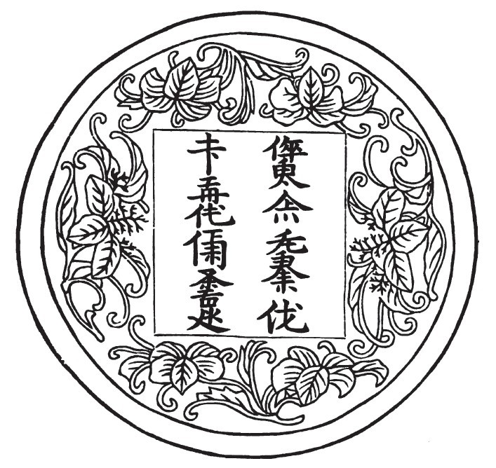

import CaptionText from '/src/components/CaptionText.astro';
import Attribution from '/src/components/Attribution.astro';

<CaptionText text='Stephen Wootton Bushell (1844-1908), "Inscriptions in the Jurchen and Allied Scripts", "Actes du Onzième Congrès International des Orientalistes" (1897) 2nd section page 21'/>

Copy of a drawing of a "medallion" with a Jurchen translation of the Chinese couplet 明王慎德、四夷咸賓 from 方氏墨譜 (Fāngshì Mòpǔ, 1588) vol. 1 folio 32b.中文：《方氏墨譜》卷一第32頁載女真文“明王慎德、四夷咸賓”印

<Attribution type='Image' copyyears='' copyholder='' author='' license='Public Domain' licenseUrl='' source='' sourceurl=''/>

<CaptionText text='This article formerly appeared on ScriptSource.'/>