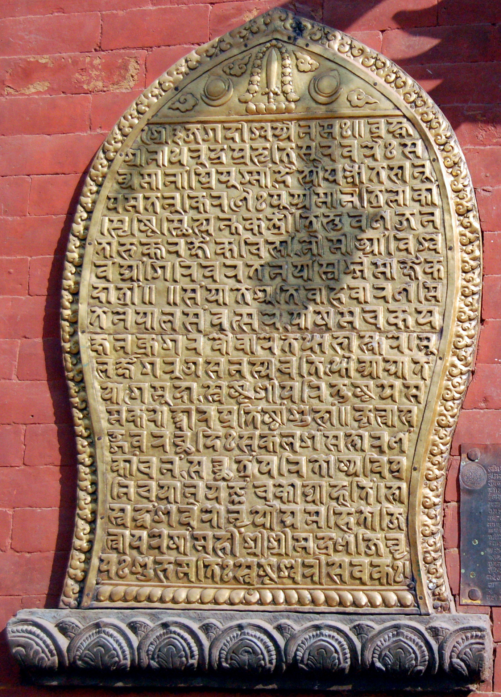

import CaptionText from '/src/components/CaptionText.astro';
import Attribution from '/src/components/Attribution.astro';

An inscription from the Golden Gate in Bhaktapur, Kathmandu, written in the Newari language using the Prachalit script.

<Attribution type='Image' copyyears='2011' copyholder='Adam Holloway' author='' license='CC BY-SA 3.0' licenseUrl='https://creativecommons.org/licenses/by-sa/3.0/' source='' sourceurl=''/>

<CaptionText text='This article formerly appeared on ScriptSource.'/>