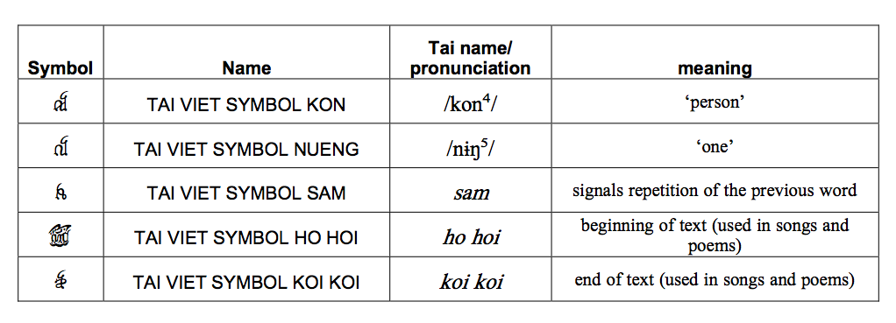

import CaptionText from '/src/components/CaptionText.astro';

There are five non-alphabetic symbols:

Two of the symbols, TAI VIET SYMBOL KON and TAI VIET SYMBOL NUENG, may be regarded as ligatures of the words meaning _person_ and _one_, respectively. In the case of TAI VIET SYMBOL KON, the use or non-use of this symbol is used to distinguish between homophonous words.

<CaptionText text='Reference: Brase, Jim. &#x201C;Proposal to encode the Tai Viet script in the UCS&#x201D;, 2007 p. 9'/>

<CaptionText text='This article formerly appeared on ScriptSource.'/>