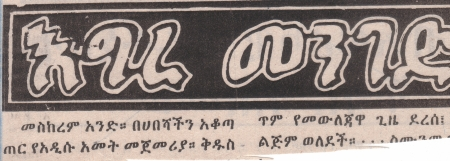
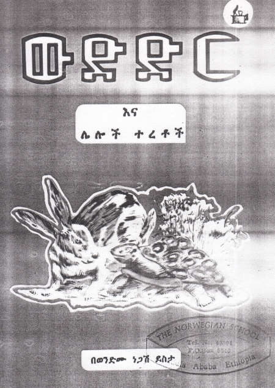
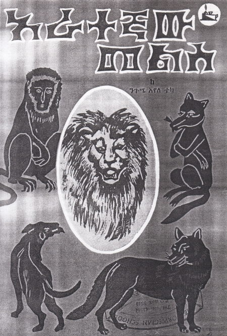

import CaptionText from '/src/components/CaptionText.astro';

Various kinds of outline style (including inverted outline) are used frequently in books, brochures and newspapers for titles and special headlines. While not a must, outline style is at least as common as in English. In some cases it is definitely used as a substitute for bold type.

<CaptionText text='This article formerly appeared on ScriptSource.'/>