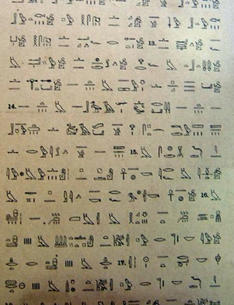

import CaptionText from '/src/components/CaptionText.astro';
import Attribution from '/src/components/Attribution.astro';

The Papyrus of Kersher is part of a funerary volume called the 'Book of Breathings', which was buried with the dead. It contained details of the burial, stories about the afterlife, religious texts, and spells. This photograph is taken from a reproduction of the Papyrus of Kersher, at the Connemara library in Chennai.

<Attribution type='Image' copyyears='2011' copyholder='Martin Raymond' author='' license='CC BY-SA 3.0' licenseUrl='https://creativecommons.org/licenses/by-sa/3.0/' source='' sourceurl=''/>

<CaptionText text='This article formerly appeared on ScriptSource.'/>