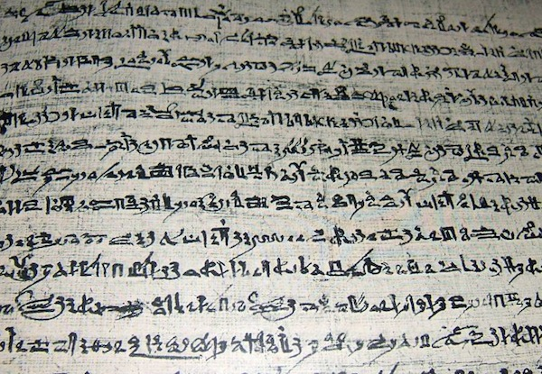

import CaptionText from '/src/components/CaptionText.astro';
import Attribution from '/src/components/Attribution.astro';

The Papyrus of Queen Netchemet is from a volume called the 'Book of the Dead', which was part of a tradition of funerary texts written in Egypt between 1550 BC and 50 BC. The texts contained religious texts, spells, and stories about the afterlife, and were written for the purpose of being buried with the dead. This photograph is taken from a parchment reproduction of the papyrus, held in the Connemara library in Chennai.

<Attribution type='Image' copyyears='2011' copyholder='Martin Raymond' author='' license='CC BY-SA 3.0' licenseUrl='https://creativecommons.org/licenses/by-sa/3.0/' source='' sourceurl=''/>

<CaptionText text='This article formerly appeared on ScriptSource.'/>