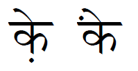

import CaptionText from '/src/components/CaptionText.astro';

The image below shows two possible positions of the :usv[093C]{usv char name} (lower dot) when it appears with a :usv[0947]{usv char name} (ekar). Very few fonts support the second example, with the dot positioned above the top bar. One exception is Microsoft's Mangal font which supports positioning above the top bar to make clear that the nukta is associated with the ekar and not the consonant.

<CaptionText text='This article formerly appeared on ScriptSource.'/>