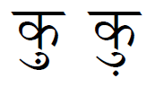

import CaptionText from '/src/components/CaptionText.astro';

The image below shows two possible positions of the :usv[093C]{usv char name} (lower dot).when it appears with the :usv[0941]{usv char name} (ukar). The second example, where the dot is positioned below vowel, is very unusual.

<CaptionText text='This article formerly appeared on ScriptSource.'/>