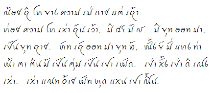

import CaptionText from '/src/components/CaptionText.astro';
import Attribution from '/src/components/Attribution.astro';

A sample of Tai Viet text typed using SIL's Tai Heritage font. The letter shapes are based on drawings by Mr. Faah Baccam.

<Attribution type='Image' copyyears='2011' copyholder='SIL International' author='' license='CC BY-SA 3.0' licenseUrl='https://creativecommons.org/licenses/by-sa/3.0/' source='' sourceurl=''/>

<CaptionText text='This article formerly appeared on ScriptSource.'/>