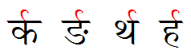
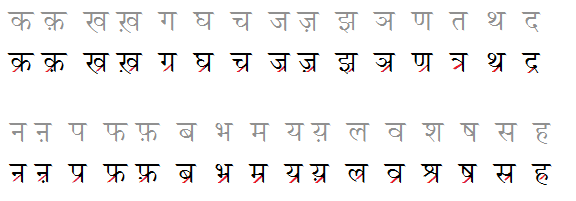
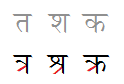
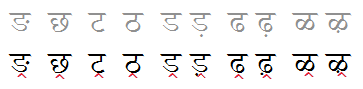
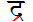
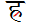
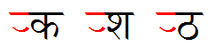
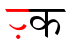
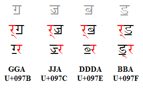
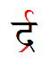

import CaptionText from '/src/components/CaptionText.astro';

The letter :usv[0930]{usv char name} forms distinctive conjuncts when it occurs in the same syllable as another consonant - i.e., when it is joined by a halant (virama). Note that the halant character (:usv[094D]{usv char name}) must be present in the encoded data but will not be visible in the conjunct.

### Reph

When a ra _precedes_ another consonant in the same syllable - i.e., when the characters in the data are: :usv[0930]{char} + :usv[094D]{char} + consonant - it takes the shape of a "reph". The reph looks like a curl that sits above the "clothesline" that the letters hang from. The following image shows the reph attached to several different consonants.

### Rakar

When the ra _follows_ a consonant in the same syllable - when the characters in the data are: consonant + :usv[094D]{char} + :usv[0930]{char} - it is written as a "rakar". A rakar can have several different forms depending on the shape of the consonant it is attached to.

When a rakar is attached to a consonant with a vertical stem, such as :usv[0915]{char} or :usv[0925]{char}, it is written as a short diagonal stroke off the vertical stem. The following image shows these consonants (gray) and the form of their rakar conjuncts.

Note that for a handful of letters, the basic shape of the letter also gets modified:

(The final form above is an alternate form of the kra conjunct.)

When rakar is attached to a consonant without a vertical stem, such as :usv[0919]{char} or :usv[0920]{char}, it is written as a shape similar to a circumflex (:usv[032D]{char}) below the consonant. The following image shows these consonants (gray) and the form of their rakar conjuncts.

Note the exceptions to the rules:

- :usv[0926]{usv char name}: although it does not have a vertical stem, the shape of the letter requires the rakar to be written as a short diagonal stroke: 
- :usv[0939]{usv char name}: although it does not have a vertical stem, the diagonal stroke is attached to the lower curve: 

### Eyelash forms

Although the letter rra (:usv[0931]{usv char}) looks similar to the ra (:usv[0930]{char}), it is written differently when it precedes another consonant in a syllable. The rra takes on the "eyelash" form as shown below.

When rra follows another consonant in a syllable, the first consonant takes on the half-form.

The eyelash form can also be used for the letter ra itself (:usv[0930]{usv}). This tends to occur before certain letters such as :usv[092F]{usv char name} or possibly :usv[0939]{usv char name}. This is indicated by a zero-width joiner character (:usv[200D]{usv}) after the ra and halant - i.e., the characters are :usv[0930]{char} + :usv[094D]{char} + :usv[200D]{usv} + consonant. Note that there is no visible difference between the sequence :usv[0931]{char} + :usv[094D]{char} and :usv[0930]{char} + :usv[094D]{char} + :usv[200D]{usv} (the latter being much more common).

Languages which use both :usv[0930]{char} and :usv[0931]{char}  in their orthography may want to preserve the dot when half-:usv[0931]{char} is rendered as the eyelash form, as shown below. This is accomplished by adding the zero-width joiner after the halant.

### Exceptions

As with other Devanagari consonants, it is possible to change the behavior of the ra by the use of the zero-width joiner (:usv[200D]{usv}) or zero-width non-joiner (:usv[200C]{usv}). Inserting a ZWNJ after the halant results in the explicit halant and/or half-form instead of the reph and rakar conjuncts. This is used, for example, in consonant clusters containing modern additions to the Devanagari script, such as the Sindhi letters shown below.

### Reph + rakar

It is rare but possible to have a single syllable containing both the reph and the rakar, as shown below.

<CaptionText text='This article formerly appeared on ScriptSource.'/>