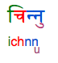

import CaptionText from '/src/components/CaptionText.astro';

The term ‘reordering’ is difficult to define, partly because the concept can be approached from two different perspectives. The definition we use on ScriptSource is that a script is said to require reordering if the order in which some characters are written does not match the order in which they are pronounced. This definition approaches the concept of reordering from an orthographic perspective.

To illustrate, the word below, written in the Devanagari script, is pronounced _chinnu_ and means “to know” in the Nepali language.

Notice that the order in which the characters are written in Devanagari does not reflect the order in which they are spoken. Specifically, the _i_ is written before the _ch_, even though it is pronounced after it.

An alternative way to approach the concept of reordering is from an encoding perspective. From this perspective, a script such as Devanagari is only said to require reordering if the characters are stored in memory in the order in which they are pronounced, but are reordered before rendering. So in the example above, the characters are stored  as च + ि + न... (ch + i + n...), but before they are rendered on the screen they are reordered to  ि  + च + न... (i + ch + n...) to produce the correct spelling of the word. This system of encoding and storing the characters is called _logical ordering_.

For the majority of scripts, the question of whether a script requires reordering is the same whichever you approach it from an orthographic or an encoding perspective. This is because, if a script requires orthographic reordering, like Devanagari, it is usually encoded in Unicode in logical order. So for the text to be correctly written or rendered, reordering is required both in the orthographic and in the encoding sense.

However, there are a small number of scripts - Thai, Lao, and Tai Viet - which require orthographic reordering, but do not require reordering in the encoding sense. This is because these scripts are encoded in Unicode in _visual order_, not in logical order. So the characters are stored in memory in the order in which they appear on the page, and do not need to be reordered before they are rendered.

For this reason, these three scripts include in their features table “Reordering: yes”, even though someone who defines the concept of reordering from an encoding perspective would disagree. These scripts do require orthographic reordering, but they are encoded in visual order, so they do not require reordering in the encoding sense.

<CaptionText text='This article formerly appeared on ScriptSource.'/>