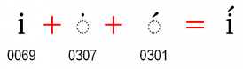

import CaptionText from '/src/components/CaptionText.astro';

Sometimes people (or language communities) wish to retain the dot on :usv[0069]{usv char name} even when there is a diacritic above the "i". This should not be part of the behavior of the font. Unicode clearly states that the dot should be removed. See [Chapter 7 of The Unicode Standard](http://www.unicode.org/versions/latest/ch07.pdf). You should encode it as U+0069 U+0307 U+0301.

There is a similar expectation for :usv[006A]{usv char name}.

<CaptionText text='This article formerly appeared on ScriptSource.'/>