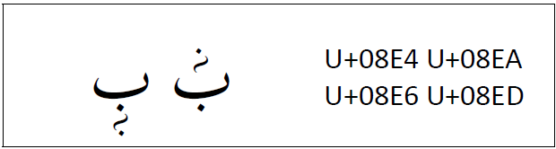
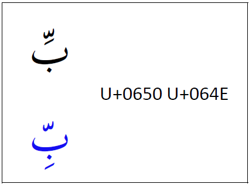
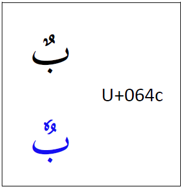
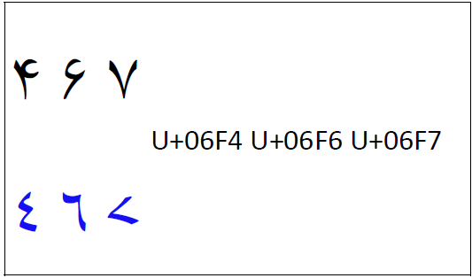

import CaptionText from '/src/components/CaptionText.astro';
import Character from '/src/components/Character.astro';

Rohingya can be written in four different scripts (Arabic, Hanifi Rohingya, Latin, and Myanmar). Fonts which are intended to support the Rohingya language using **Arabic script** must include some different lesser used characters as well as different design features than those designed for standard Arabic. In every case, the blue is what a Rohingya font should support.

Rohingya includes some special characters which are not used in any other known language. These are:

- <Character usv="08aa" options="usv,char,name"/>
- <Character usv="08ab" options="usv,char,name"/>
- <Character usv="08ac" options="usv,char,name"/>
- <Character usv="08e4" options="usv,char,name"/>
- <Character usv="08e5" options="usv,char,name"/>
- <Character usv="08e6" options="usv,char,name"/>
- <Character usv="08e7" options="usv,char,name"/>
- <Character usv="08e8" options="usv,char,name"/>
- <Character usv="08e9" options="usv,char,name"/>
- <Character usv="08ea" options="usv,char,name"/>
- <Character usv="08eb" options="usv,char,name"/>
- <Character usv="08ec" options="usv,char,name"/>
- <Character usv="08ed" options="usv,char,name"/>
- <Character usv="08ee" options="usv,char,name"/>
- <Character usv="08ef" options="usv,char,name"/>

The first three characters in the above list are right-joining characters. Next, we have six vowel marks, followed by six tone marks. The vowel marks behave as other vowel marks in Arabic script. However, the tone marks will always appear following a vowel mark. If the vowel is an above mark, then the following tone must also be an above mark. If the vowel is a below mark, then the following tone must also be an above mark.

<CaptionText text='Rohingya tone.'/>

When a _kasra_ is used in context with the _shadda_, most Arabic fonts will move the _kasra_ up and ligate it below the _shadda_. This should not happen for Rohingya support. The _kasra_ should remain below the base. 

<CaptionText text='Rohingya shadda-kasra in blue.'/>

The Rohingya prefer a different style of _dammatan_. 

<CaptionText text='Rohingya dammatan in blue.'/>

Rohingya has a different style of digits for <Character usv="06F4" options="usv,char,name"/>, <Character usv="06F6" options="usv,char,name"/> and <Character usv="06F7" options="usv,char,name"/>.

<CaptionText text='Rohingya digits in blue.'/>

