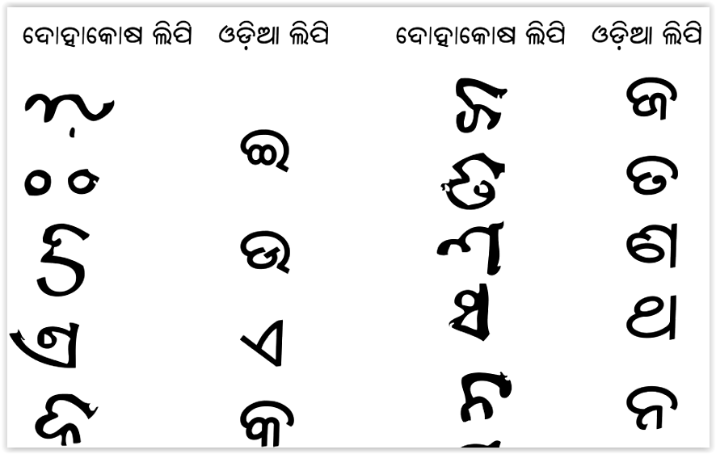

import CaptionText from '/src/components/CaptionText.astro';
import Attribution from '/src/components/Attribution.astro';

This sample is taken from a Buddhist text from around 1060 AD written by Sarahapada.

<CaptionText text='Reference: Pandit Rahul Sanskrutayan, Banshidhar Mohanty'/>

<Attribution type='Article' copyyears='' copyholder='' author='Pandit Rahul Sanskrutayan, Banshidhar Mohanty' license='CC0' licenseUrl='https://creativecommons.org/public-domain/cc0/'/>

<CaptionText text='This article formerly appeared on ScriptSource.'/>