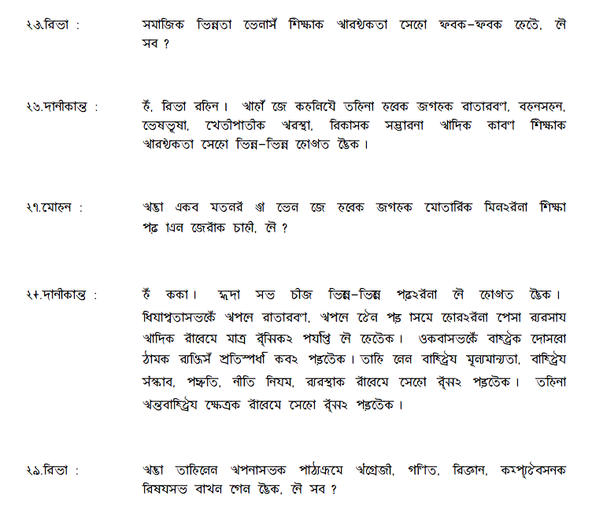

import CaptionText from '/src/components/CaptionText.astro';
import Attribution from '/src/components/Attribution.astro';

An excerpt from page 4 of the Open Learning Program: Program 1, a document written for the Government of Nepal by Professor Yogendra Yadava, advocating Maithili open learning.

<Attribution type='Image' copyyears='2010' copyholder='Yogendra Yadava' author='' license='CC BY-SA 3.0' licenseUrl='https://creativecommons.org/licenses/by-sa/3.0/' source='' sourceurl=''/>

<CaptionText text='This article formerly appeared on ScriptSource.'/>