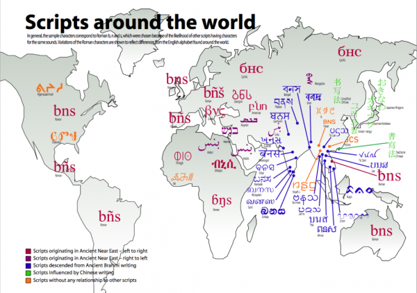

import CaptionText from '/src/components/CaptionText.astro';
import Attribution from '/src/components/Attribution.astro';

This map shows a selection of scripts used around the world, arranged geographically and colour-coded by genetic affiliation. <a download href="/files/scripts-around-the-world.zip">Scripts around the world</a> is available in the attached zip file in PDF and Illustrator format and is released under a Creative Commons license. The map is produced by SIL, but inclusion of a script on the map does not imply SIL involvement in a project using that script.

<Attribution type='Article' copyyears='1998-2026' copyholder='SIL Global' author='' license='CC BY-SA 3.0' licenseurl='https://creativecommons.org/licenses/by-sa/3.0/'/>

<CaptionText text='This article formerly appeared on ScriptSource.'/>