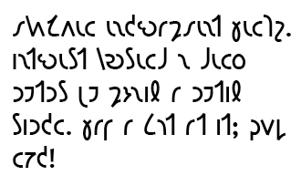

import CaptionText from '/src/components/CaptionText.astro';
import Attribution from '/src/components/Attribution.astro';

This text is adapted and re-typed from Kingsley Read's _Suggestions for writing_, published in Worcester in 1962. The text reads:

Mutual encouragement helps. 
Interest yourself and fellow 
writers by joining a writing 
circle. Have a go at it; good 
luck!

<Attribution type='Image' copyyears='2011' copyholder='SIL International' author='' license='CC BY-SA 3.0' licenseUrl='https://creativecommons.org/licenses/by-sa/3.0/' source='' sourceurl=''/>

<CaptionText text='This article formerly appeared on ScriptSource.'/>