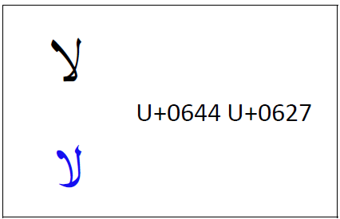
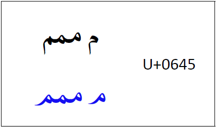
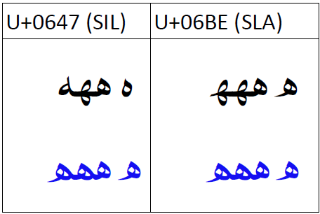
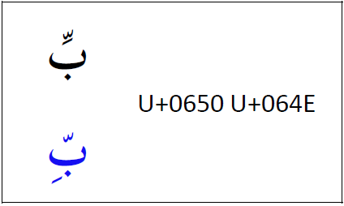
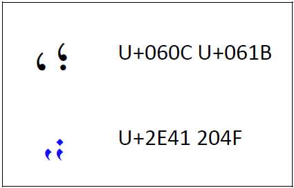
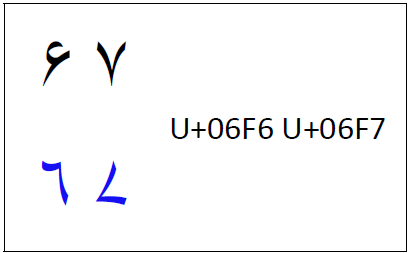

import CaptionText from '/src/components/CaptionText.astro';
import Character from '/src/components/Character.astro';

Fonts which are intended to support the Sindhi language must include some different design features than those designed for standard Arabic. In every case, the blue is what a Sindhi font should support.

The _lam-alef_ ligature should be designed in a Sindhi-style.

<CaptionText text='Sindhi lam-alef.'/>

The _meem_ should have a short tail.

<CaptionText text='Sindhi meem.'/>

There is some disagreement on which _heh_ codepoint should be used for Sindhi. The shape of the character is not in disagreement, but which codepoint should be used is not clear. SIL has chosen to use <Character usv="0647" options="usv,char,name"/>, and the Sindhi Language Authority has used <Character usv="06BE" options="usv,char,name"/>.

<CaptionText text='Sindhi heh.'/>

When a _kasra_ is used in context with the _shadda_, most Arabic fonts will move the _kasra_ up and ligate it below the _shadda_. This should not happen for Sindhi support. The _kasra_ should remain below the base. Also, note that diacritics on isolate and final forms of characters are left offset to the _nukat_.

<CaptionText text='Sindhi shadda-kasra.'/>

The Sindhi style of comma and semi-colon (<Character usv="060C" options="usv,char,name"/> and <Character usv="061B" options="usv,char,name"/>) is to be downward rather than upward. Instead of making this a glyph variant, the Unicode Standard says to use different codepoints, namely <Character usv="2E41" options="usv,char,name"/> and <Character usv="204F" options="usv,char,name"/>.

<CaptionText text='Sindhi comma and semi-colon.'/>

Sindhi has a different style of digits for <Character usv="06F6" options="usv,char,name"/> and <Character usv="06F7" options="usv,char,name"/>.

<CaptionText text='Sindhi digits.'/>

