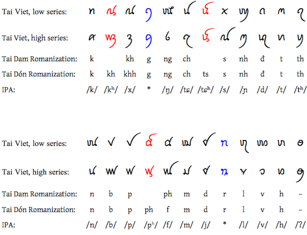

import CaptionText from '/src/components/CaptionText.astro';
import Attribution from '/src/components/Attribution.astro';

This chart shows only the Tai Viet consonants which are encoded in Unicode 5.2. 

As well as the three pairs of letters here (in red) which are only used for writing Tai Don, an additional six Tai Don letters also exist, which are not encoded in Unicode. 

The two pairs of letters shown here in blue are only used for loan words. The phonemic value of these characters depends on the origin of the word. 

The Romanizations used in this chart are based on popular usage of the Vietnamese alphabet for writing the Tai languages.

<Attribution type='Image' copyyears='2011' copyholder='SIL International' author='' license='CC BY-SA 3.0' licenseUrl='https://creativecommons.org/licenses/by-sa/3.0/' source='' sourceurl=''/>

<CaptionText text='This article formerly appeared on ScriptSource.'/>