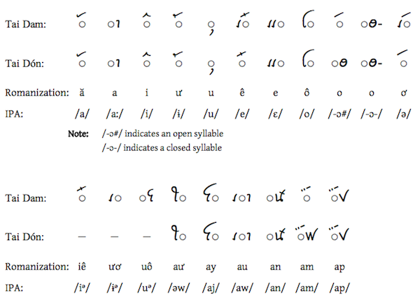

import CaptionText from '/src/components/CaptionText.astro';
import Attribution from '/src/components/Attribution.astro';

Tai Viet uses _visual order_ - characters are entered and stroed in the order in which they appear on paper. The dotted circle is used here to represent the syllable's initial consonant, in order to show the correct data order and visual positioning of the vowels - the font should not reorder the data.

The Tai Daeng vowel is quite different from the Tai Dam and Tai Don. In spoken form, the languages has length contrast on all vowels. No determination has been made as to how this is shown in writing. 

Tai Don vowels also include a final /-at/ ligature which is not encoded in Unicode, and not included in this chart..

<Attribution type='Image' copyyears='2011' copyholder='SIL International' author='' license='CC BY-SA 3.0' licenseUrl='https://creativecommons.org/licenses/by-sa/3.0/' source='' sourceurl=''/>

<CaptionText text='This article formerly appeared on ScriptSource.'/>