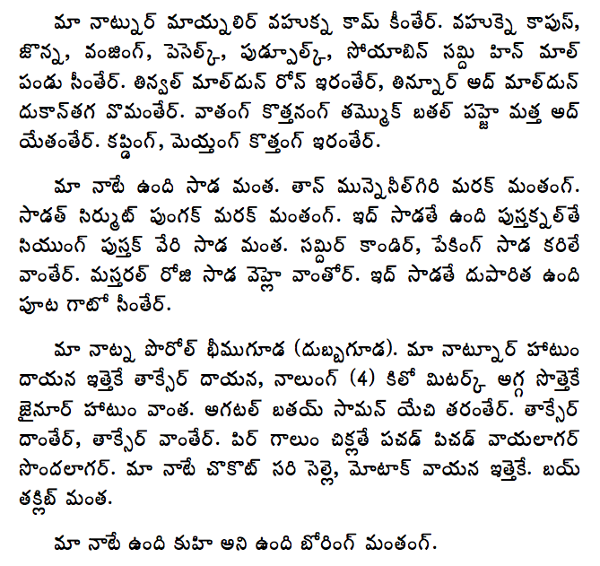

import CaptionText from '/src/components/CaptionText.astro';
import Attribution from '/src/components/Attribution.astro';

This is an excerpt taken from a literacy book called _karikīkaṭ_ (Let us Read), written in the Southern Gondi language using the Telugu script. The full book is available as a PDF download from [Gondwana](http://www.gondwana.in/ap/index.htm), a rural development company based in South India. Used with permission of the editors.

<Attribution type='Image' copyyears='2008' copyholder='Integrated Tribal Development Agency and SIL International' author='' license='CC BY-SA 3.0' licenseUrl='https://creativecommons.org/licenses/by-sa/3.0/' source='' sourceurl=''/>

<CaptionText text='This article formerly appeared on ScriptSource.'/>