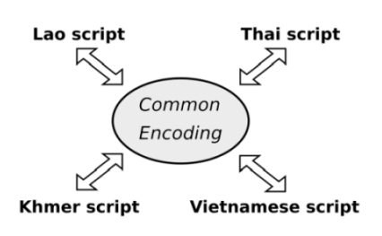

There are many languages that are written in more than one script. Texts look completely different in two scripts but sound and mean the exact same thing. There are two approaches to achieving the production of the same text in multiple scripts. One approach is to simply convert from one script to another. But what if we have more than two scripts involved, could we convert to a common interlingua type encoding from which text in any of the other scripts could be generated easily? We will examine both approaches and their relative problems and merits.

### Direct Conversion

The simplest approach to consider is that of mapping between two different scripts. A program reads text in one script and generates the identical text in another script. Given that most orthographies are based on the phonemes of a language, one can simply convert the source orthography into the phonemes and then express those in the target script.

The problem here is that most orthographies, especially those that have existed across any kind of language shift, are not all that pure. Some orthographies are over-differentiated; they have two ways of spelling the same thing. This is not difficult to 'read' but is hard when it comes to generating text in that script. Some orthographies are under-differentiated; one can only understand what the text says in context. Which phonemes do these characters result in? An orthography may start out being relatively pure, with little under- or over-differentiation. But as languages shift (phonemes split or combine, tonal systems change), often their orthographies do not and the result is that the orthography loses its purity and becomes more complex.

Add into this mix loanwords from foreign languages. They can introduce unexpected phonemes or phonemic sequences that are not in the main language. Again, how an orthography handles these may add complexity to the orthography.

The result is that while it is possible to convert a lot of text in a language directly between two orthographies, there is almost always a residue of words that do not fit the pattern or that need to be handled directly because they are ambiguous in one or both of the scripts.

### Common Encoding

We've looked at direct conversion between two scripts. But what if we could come up with a pure script, a common encoding that represents the language, and then convert from that? Could that give us a simple transformation that always works?

One of the difficulties with this approach is that the common encoding needs to hold all the over-differentiation that occurs in all the scripts the text may be output in. For Latin script, for example, it must store case for proper nouns.

The result is, in effect, yet another orthography for the language that may not be in a convenient script for a typist. Someone typing the language in Lao script has to be concerned with case, even though there is no concept of case in Lao script. How is this extra information, then, presented in Lao script? A Latin script typist has to handle the different kinds of word breaks that Lao script has, with no space between words but spaces between phrases. The Lao script user has to think about commas and periods. The Latin script user may not have as expressive a way of presenting tone as does the Lao script, and so the complexities go on.

The common encoding becomes something that only a few experts can use and even then may need changing in response to other scripts in which the language may need to be rendered.

Having worked with various cross-script conversion projects, we see value in a common encoding, but in practice its value is only as a transition between two orthographies as a way of reducing the number of conversion descriptions needed. The encoding itself is an implementation detail and not something any reader or writer of the language should ever have to deal with.

As such, therefore, it would be inappropriate to publish such a common encoding as part of a standard. This is on top of the core principle of Unicode that it is a character encoding and not an encoding of morphophonemics.

### Solution

The ideal situation is that a user can type their language in the script of their choice, select the text and then convert it to another script, complete with appropriate font and style changes. There are a number of steps that need to happen for this to be available.

The conversion converts from one script directly to another. This may be a two step process, from the source script to an intermediate encoding and then out to the target script, or it can be direct. Different languages and script collections have different needs and solutions. How that direct conversion occurs is an implementation detail.

Different applications may support conversion in different ways. There is plenty of opportunity to see growth in this area. [SIL Converters][sil-converters] is one such solution which, while not directed at multi-script conversion directly, can be used for it.

[sil-converters]: https://software.sil.org/silconverters/

