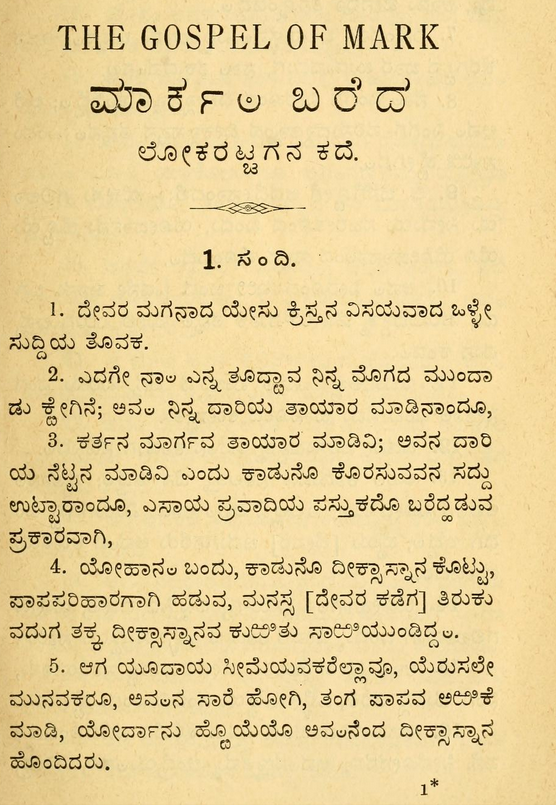

import CaptionText from '/src/components/CaptionText.astro';
import Attribution from '/src/components/Attribution.astro';

The text shows Badaga in Kannada script. Several symbols specific to Badaga orthography such as spaced Chandrabindu (possibly for nasalization), and subjoined ḻ (perhaps to indicate retroflex vowels) can be seen in the sample.

<Attribution type='Image' copyyears='' copyholder='' author='' license='Public Domain' licenseUrl='' source='' sourceurl=''/>

<CaptionText text='This article formerly appeared on ScriptSource.'/>