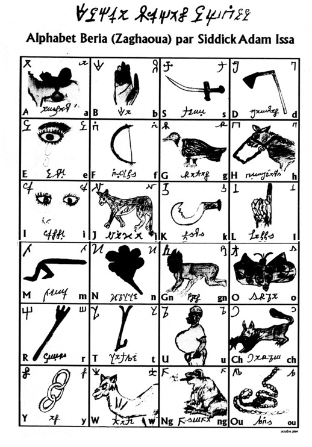

import CaptionText from '/src/components/CaptionText.astro';
import Attribution from '/src/components/Attribution.astro';

An alphabet chart depicting the upper and lower case variants for each letter, with their Latin equivalents, and a picture of a word which begins with each letter in the Zaghawa language,

<Attribution type='Image' copyyears='2009' copyholder='SIL International' author='' license='CC BY-SA 3.0' licenseUrl='https://creativecommons.org/licenses/by-sa/3.0/' source='' sourceurl=''/>

<CaptionText text='This article formerly appeared on ScriptSource.'/>