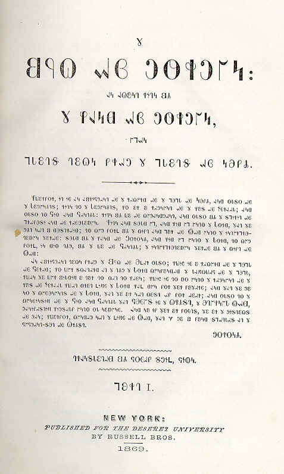

import CaptionText from '/src/components/CaptionText.astro';
import Attribution from '/src/components/Attribution.astro';

An early edition of the Book of Mormon, printed in 1869 in the Deseret script. Image used with permission from Toppan Rare Books Library and the American Heritage Center.

<Attribution type='Image' copyyears='' copyholder='' author='' license='Public Domain' licenseurl='' source='Toppan Rare Books Library' sourceurl='http://www.uwyo.edu/ahc/toppan/rare-books.html#13'/>

<CaptionText text='This article formerly appeared on ScriptSource.'/>