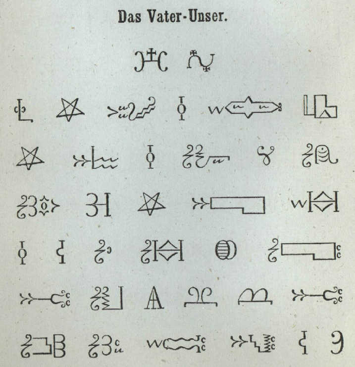

import CaptionText from '/src/components/CaptionText.astro';
import Attribution from '/src/components/Attribution.astro';

<CaptionText text='Christian Kauder, Buch, das gut, enhaltend den Katechismus, Betrachtung, Gesang, _The Good Book, containing the Catechism, Meditations, Hymns_, The Imperial and Royal Printing Press, Vienna, 1866'/>

The Lord's Prayer, taken from an 1866 manual of prayers, instructions, psalms and hymns written in the Micmac language and script.

<Attribution type='Image' copyyears='' copyholder='' author='' license='Public Domain' licenseurl='' source='' sourceurl=''/>

<CaptionText text='This article formerly appeared on ScriptSource.'/>